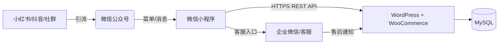

# 🌾 微信小程序 + WordPress 无头电商系统

## **功能规格及技术架构说明书（V1.0 - 最终冻结版）**

> **定位**：以“高品质农产品”为起点，构建“内容种草 → 社交裂变 → 小程序成交 → 私域复购”闭环。
> **原则**：一期验证核心交易流，二期启动营销与虚拟商品，三期实现自动化私域运营。
> **承诺**：所有功能均已保留，无一删除；所有技术方案均可执行、可扩展、无推倒重来风险。

------

## 一、整体技术架构



### 核心设计原则

| 原则             | 说明                                           |
| ---------------- | ---------------------------------------------- |
| **数据唯一源**   | WordPress 是唯一数据中枢，小程序仅为展示层     |
| **支付闭环**     | 微信支付官方通道 + 自动回调更新订单状态        |
| **用户资产沉淀** | 所有流量转化为 WordPress 用户 + 企业微信好友   |
| **字段只增不改** | 数据库与 API 字段永不删除或重命名              |
| **合规优先**     | 遵守微信小程序规范、用户隐私政策、支付监管要求 |

------

## 二、功能清单与分期规划（完整保留所有功能）

### ✅ 第一期：MVP 核心交易闭环（2周内上线）

| 模块         | 功能                  | 技术实现                                                     |
| ------------ | --------------------- | ------------------------------------------------------------ |
| **用户体系** | 微信授权登录          | 绑定 `openid` 到 WordPress 用户                              |
|              | 基础资料展示          | 昵称、头像（来自 `usermeta`）                                |
| **营销引擎** | **邀请裂变最小闭环**  | 提供专属邀请码 + 场景码；落地页记录渠道参数；小程序端展示邀请统计 |
|              | **首页营销位管理**    | 后台 `wp_options` + Elementor 模板管理轮播/推荐区；提供 `/config/public` 接口给前端读取 |
| **商品系统** | 商品列表（3款大米）   | WooCommerce 变体产品（24 SKU）                               |
|              | 商品详情页            | 展示属性、库存、描述                                         |
| **购物车**   | 加购 + 登录同步       | 同步至 `user_meta: cart_items` 自研轻量购物车：<br/>- 数据结构：[{product_id, variation_id, quantity}]<br/>- 存储位置：wp_usermeta.meta_value（JSON 字符串）<br/>- 所有增删改通过后端接口串行处理 |
| **订单流程** | 提交订单（含地址）    | 调用 WooCommerce 创建 `pending` 订单                         |
|              | 微信支付             | 支付成功后订单进入 `processing`（支付成功/待发货）            |
|              | 发货与签收           | 发货后进入 `on-hold`（已发货/运输中），签收后 `completed`      |
| **售后协同** | 退货申请 + 审核       | 用户在订单详情提交退货原因/图片，后台同意后自动退款            |

> 🔑 **交付标准**：用户可完成“浏览 → 加购 → 下单 → 扫码付款 → 联系客服”全流程。

------

### ✅ 第二期：社交裂变 + 虚拟购物卡（重点！）

| 模块         | 功能                     | 技术实现                                                     |
| ------------ | ------------------------ | ------------------------------------------------------------ |
| **首页运营** | 运营位进阶               | 运营可通过后台配置 banner/推荐/活动区排序与跳转，实时下发到 `/config/public` |
|              | 内容营销入口             | 后台可上传图文/视频素材，首页/详情页动态挂载                 |
| **会员体系** | 积分系统                 | `wp_myshop_point_ledger` 记录明细（earn/spend/adjust/expire）；支持积分有效期（定时任务每日清理过期）、即将过期统计；自研 API 提供积分总览、流水分页、签到领取、任务中心、兑换项 |
|              | 优惠券领取/使用          | 复用 WooCommerce 优惠券，定义与积分互斥/叠加规则             |
| **社交裂变** | 一级分销（正式版）       | 自定义表 `wp_myshop_referrals` 存邀请关系；提供邀请码、渠道统计、层级同步 |
|              | 佣金政策配置 + 结算流程  | 自定义表 `wp_myshop_commissions`；后台配置一级/二级比例、提现门槛；佣金状态 `pending → approved → paid` |
|              | 海报生成                 | 小程序 canvas + scene 参数带邀请码；提供后台模板管理         |
| **虚拟商品** | **虚拟购物卡（重点）**   | ✅ - 商品类型：WooCommerce 虚拟 + 可下载<br/>- 模板类型：① **储值卡**（任意金额）② **固定组合卡**（后台配置 SKU 组合）③ **任意组合卡**（用户自由搭配）<br/>- 购卡流程：订单完成后自动生成卡片，仅记录模板/金额/快照，不产生祝福语<br/>- 分享流程：用户在卡包中选择卡 → 选择后台配置的模板图案 → 可沿用/编辑/清空祝福语 → 生成数字分享二维码 + 可下载 PDF（同一模板）<br/>- 领取流程：受赠人长按/扫码 → 登录 → 确认提示页 → 自动入库 → 跳转“我的”页面<br/>- 使用方式：储值卡在购物车/支付页抵扣；固定/任意组合卡触发 0 元兑换订单；所有兑换动作写入 `wp_myshop_gift_card_usage` |
|              | 实物购物卡               | 作为普通商品发货，卡号后台批量生成，支持批量导入             |
| **外部联动** | 小红书晒单图             | 小程序生成带二维码海报                                       |
|              | 抖音视频嵌入             | 商品页播放后台上传视频                                       |

> 💡 **虚拟购物卡关键逻辑（更新）**：
>
> - 购卡人 ≠ 收卡人，**收货地址由兑换人提供**；购卡阶段不生成祝福语。
> - 分享统一走“模板选择 + 祝福语可选”模式：模板来自后台，祝福语默认可修改或清空。
> - 电子版二维码与 PDF 打印共用同一模板；二维码内嵌 `share_token`，无需 PIN。
> - 受赠人扫码 → 登录 → 确认提示 → 自动入库 → 跳转“我的”页面。
> - 卡片任何时刻只绑定一个用户，但当前持有人可再次分享，所有记录仅对持有人与后台可见。
> - 储值卡等同现金，在购物车/支付页与优惠券叠加使用；组合类卡片触发 0 元订单兑换。
> - 购卡、分享、领取、兑换、撤销全流程写入日志，以便运营后台追溯与导出。

#### 🎁 购物卡分享 / 兑换 / 安全流程（更新）

- **分享模板**：后台可上传多套模板（含默认祝福语、配色、图标）。前端仅能选择模板，无法自定义图案；祝福语支持使用默认、修改或清空。
- **数字赠礼 & 打印**：同一模板输出两种载体（小程序码、PDF）。二维码指向统一领取入口，所有分享方式安全等级一致。
- **领取确认**：受赠人扫码 → 微信登录 → 显示提示页（说明领取后卡片将存入卡包、查找方式及使用方式）→ 点击确认即绑定并跳转“我的”页面。
- **兑换流程**：
    1. 点击“购物卡兑换商品”即弹出卡片列表；
    2. 选择卡片后直接进入兑换订单页，展示卡快照、地址表单；
    3. 提交生成 0 元订单（无需上传凭证），同时更新卡余额/状态。
- **储值抵扣**：支付页显示“使用储值卡”“使用优惠券”入口，提示用户资产情况；储值卡抵扣顺序为“优惠券后”。
- **日志留痕**：所有分享/领取/兑换/作废行为写入 `wp_myshop_gift_card_usage` 与 `share_logs`，后台可查询导出。

#### 🔁 积分系统关键逻辑

- **积分类型**：`earn`（订单赠送）、`spend`（抵扣订单）、`adjust`（人工调整）、`expire`（系统过期扣减）。
- **总分 + 明细**：`wp_myshop_point_ledger` 记录所有流水，字段含 `reference_order_id`、`delta`、`balance_after`、`expire_at`、`channel`；用户资料接口返回余额。
- **有效期**：默认 365 天（可配置）。每日定时任务扫描过期积分并生成 `expire` 记录；“即将过期”按 30 天窗口统计。
- **使用策略**：下单时按规则计算可抵扣金额并在支付后写入扣减流水（无需积分预占）。
- **前台能力**：提供“我的积分”页面，展示可用、待确认、即将过期与流水；任务中心与签到领取发放积分。
- **后台对账**：流水表支持按时间/渠道导出；任务与兑换项由运营后台配置。

#### 🤝 代理商体系关键设计

- **身份认证**：`wp_myshop_agents` 保存代理层级、归属区域、入驻日期、状态；代理可与消费者身份共存。
- **绩效指标**：`team_sales_amount`、`team_order_count`、`pending_commission_total`、`monthly_growth_rate` 等字段通过聚合视图/缓存计算，前端展示仪表盘。
- **下级管理**：支持分页查询下级代理，字段包含 `level`、`team_sales`、`active_clients`、`last_active_at`；提供关键字搜索与渠道筛选。
- **运营操作**：后台可调整代理等级、冻结账户、重置邀请码；所有操作写入 `wp_myshop_agent_audit_logs`。
- **合规留痕**：代理佣金与消费者佣金分表统计，财务导出需区分 `commission_type=agent`；核销快照保留 3 年。

------

### 🎛️ 运营自助工具与渠道归因（跨阶段持续完善）

| 工具/能力           | 一期交付                            | 二期强化                                 | 备注 |
| ------------------- | ----------------------------------- | ---------------------------------------- | ---- |
| 营销位管理          | 后台可编辑 banner/推荐区/活动图文   | 支持定时上线、A/B 测试、内容版本回滚     | 数据存在 `wp_options` + Elementor 模板 |
| 渠道参数归因        | 场景码携带渠道参数，记录落地页访问 | 与邀请/分销数据打通，生成渠道排行榜     | 需保留原始渠道日志表 |
| 邀请裂变面板        | 小程序端展示邀请人数、首单状态     | 后台统计裂变转化、奖励发放状态           | 指标口径与数据看板统一 |
| 海报/素材模板管理   | 后台上传基础模板                   | 模板分组、动态变量注入、素材审批流程     | 素材走企业微信/内容库 |
| 客服审核操作指引    | 订单备注记录人工审核过程           | 审核日志可导出，结合佣金与积分发放流程   | 关联客户服务 SOP |
| **优惠组合套装（二期新增）** | 无 | **跨规格组合销售，如"10kg普通米+2kg有机米体验装"** | 见下方详细设计 |

------

### 🎁 优惠组合套装（Bundle Product）- 二期功能

#### 业务场景
支持跨规格、跨品质组合销售，例如：
- "袋装10kg普通种植稻花香 + 2kg体验装有机稻花香" 组合价 ¥150（原价 ¥189）
- "礼盒A 5kg有机稻花香 + 2袋真空装珍珠米" 组合价 ¥200

#### 技术实现

**数据表设计**：
```sql
-- 组合商品主表
CREATE TABLE wp_myshop_bundles (
  bundle_id BIGINT PRIMARY KEY AUTO_INCREMENT,
  name VARCHAR(255) NOT NULL,
  description TEXT,
  image_url VARCHAR(500),
  original_price DECIMAL(10,2),  -- 单买总价
  bundle_price DECIMAL(10,2),    -- 组合优惠价
  discount_type ENUM('fixed', 'percentage'), -- 固定减价或百分比折扣
  status ENUM('active', 'inactive') DEFAULT 'active',
  created_at DATETIME,
  updated_at DATETIME
);

-- 组合商品明细表
CREATE TABLE wp_myshop_bundle_items (
  id BIGINT PRIMARY KEY AUTO_INCREMENT,
  bundle_id BIGINT,
  product_id BIGINT,      -- 父商品ID
  variation_id BIGINT,    -- 变体ID（如果是变体商品）
  quantity INT DEFAULT 1, -- 该商品在组合中的数量
  FOREIGN KEY (bundle_id) REFERENCES wp_myshop_bundles(bundle_id)
);
```

**API 接口**：
- `GET /products/bundles` - 获取所有组合商品列表
- `GET /products/bundles/{id}` - 获取组合商品详情（含所有子商品）
- `POST /cart/add-bundle` - 将整个组合加入购物车
- `POST /admin/bundles` - 后台创建组合商品

**前端展示**：
- 首页/商品列表显示组合商品卡片（带"优惠套装"徽章）
- 创建 `pages/product/bundle` 组合详情页：
  - 展示包含的所有商品（图片、名称、规格）
  - 价格对比（原价 vs 组合价，节省金额）
  - "立即购买"/"加入购物车"按钮
- 购物车中组合商品展开显示内部商品明细
- 订单详情展示组合商品的拆分明细

**库存与限制**：
- 加入购物车前检查所有子商品库存
- 组合商品不支持单独修改子商品数量（只能删除整个组合）
- 退款时整个组合按组合价退款（不支持部分退）

**优先级**：低（二期功能）
**预计工期**：5-7天

------

### ✅ 第三期：私域自动化闭环

| 模块           | 功能                                               |
| -------------- | -------------------------------------------------- |
| **支付系统**   | 微信支付通道稳定化；支持退款与回调处理               |
| **公众号联动** | 关注领券、模板消息通知；与小程序邀请链路打通         |
| **物流管理**   | 快递单号录入 + 物流查询；用户可跟踪物流进度          |
| **数据看板**   | 销售额、分销 GMV、邀请转化率、虚拟卡兑换率等核心指标；支持导出 |
| **多级分销**   | 支持二级及以上佣金计算（需扩展 referral 表），提供代理业绩排行 |

------

## 三、数据模型设计（面向未来，一次定型）

### 1. 复用 WordPress 内建表（优先）

| 用途      | 存储位置                    | 字段示例                                                     |
| --------- | --------------------------- | ------------------------------------------------------------ |
| 用户账户  | `wp_users`                  | `user_login`, `user_email`                                   |
| 用户扩展  | `wp_usermeta`               | `phone`, `wechat_openid`, `referrer_id`, `invite_code`, `total_points` |
| 商品/订单 | `wp_posts` + `wp_postmeta`  | WooCommerce 原生结构                                         |
| 地址信息  | WooCommerce Customer Object | `billing_address_1`, `shipping_city` 等                      |

> ✅ **优势**：无需重复造轮子，天然兼容 WooCommerce 插件生态。

### 2. 自定义表（仅当必要，第二期创建）

| 表名                              | 用途             | 关键字段                                                     |
| --------------------------------- | ---------------- | ------------------------------------------------------------ |
| `wp_myshop_referrals`             | 推广关系         | `user_id`, `referrer_id`, `level`, `channel_code`            |
| `wp_myshop_commissions`           | 佣金流水         | `earner_id`, `order_id`, `amount`, `status`, `payout_batch`  |
| `wp_myshop_commission_policies`   | 佣金策略配置     | `level`, `rate`, `effective_from`, `effective_to`, `channel` |
| `wp_myshop_invitation_logs`       | 渠道归因日志     | `invitee_openid`, `inviter_id`, `channel`, `scene`, `visited_at`, `first_order_id` |
| `wp_myshop_marketing_assets`      | 营销素材/模板     | `type`, `title`, `content_url`, `config_json`, `status`      |
| `wp_myshop_point_ledger`          | 积分流水         | `user_id`, `delta`, `balance_after`, `reference_order_id`, `expire_at`, `status`, `channel`, `operator_id` |
| `wp_myshop_gift_cards`            | **购物卡主表**   | `card_number`, `template_id`, `template_type`, `initial_amount`, `balance`, `currency`, `card_snapshot(json)`, `purchase_order_id`, `owner_user_id`, `current_holder_user_id`, `share_state`, `share_meta(json)`, `delivery_modes`, `expires_at`, `status`, `created_at`, `updated_at` |
| `wp_myshop_gift_card_redemptions` | 兑换/抵扣记录     | `card_id`, `order_id`, `redeem_type`(`redeem_order`/`payment_deduction`), `delta_amount`, `balance_after`, `channel`, `operator_id`, `created_at`, `extra(json)` |
| `wp_myshop_agents`                | 代理商资料       | `agent_user_id`, `agent_code`, `level`, `parent_agent_id`, `region`, `status`, `joined_at`, `invite_qr`, `team_target` |
| `wp_myshop_agent_audit_logs`      | 代理操作日志     | `agent_user_id`, `action`, `reason`, `operator_id`, `created_at`, `payload` |

> 📌 **建表时机**：第二期开发前，通过插件升级脚本初始化。

------

## 四、API 接口契约（核心自定义部分）

> 🔐 认证机制：
>
> 所有自定义 API（/myshop/v1/*）采用 JWT Token 认证，依赖免费插件 JWT Authentication for WP-API（WordPress 官方插件库可下载）。该插件仅用于 token 签发与验证，无任何付费功能。

| 接口                                 | 方法            | 一期 | 二期 | 说明                                                         |
| ------------------------------------ | --------------- | ---- | ---- | ------------------------------------------------------------ |
| `/myshop/v1/auth/login`              | POST            | ✅    | ✅    | 微信 code 换 token                                          |
| `/myshop/v1/me`                      | GET             | ✅    | ✅    | 返回用户资料、邀请码、基础积分信息                          |
| `/myshop/v1/config/public`           | GET             | ✅    | ✅    | 首页运营位/公共配置                                      |
| `/myshop/v1/invitations/summary`     | GET             | ✅    | ✅    | 当前用户邀请人数、首单转化状态                              |
| `/myshop/v1/invitations/track`       | POST            | ✅    | ✅    | 记录渠道参数与落地页访问                                    |
| `/myshop/v1/cart`                    | GET/POST/DELETE | ✅    | ✅    | 购物车增删改查，服务端串行持久化                             |
| `/myshop/v1/orders`                  | POST            | ✅    | ✅    | 创建订单                                                   |
| `/myshop/v1/orders`                  | GET             | ✅    | ✅    | 订单列表（含退货状态）                                     |
| `/myshop/v1/referrals/my-downlines`  | GET             | ❌    | ✅    | 一级分销成员列表                                            |
| `/myshop/v1/commissions`             | GET             | ❌    | ✅    | 佣金流水+状态                                               |
| `/myshop/v1/commissions/payout`      | POST            | ❌    | ✅    | 后台触发佣金打款或审核流程                                  |
| `/myshop/v1/gift-cards/redeem`       | POST            | ❌    | ✅    | 购物卡兑换接口（生成 0 元订单/扣减余额）                   |
| `/myshop/v1/gift-cards/{card}/share` | POST            | ❌    | ✅    | 生成分享 token（指定模板、祝福语），返回二维码+PDF 链接     |
| `/myshop/v1/gift-cards/{card}/revoke-share` | POST     | ❌    | ✅    | 撤销分享 token（卡状态恢复）                               |
| `/myshop/v1/gift-cards/share/{token}/claim` | POST     | ❌    | ✅    | 受赠人确认领取，绑定到当前登录用户                         |
| `/myshop/v1/gift-cards` (admin)      | GET/POST        | ❌    | ✅    | 后台卡片查询 / 作废 / 转移 / 导出                          |
| `/myshop/v1/agents/me`               | GET             | ❌    | ✅    | 代理商资料与业绩数据                                        |
| `/myshop/v1/agents/downlines`        | GET             | ❌    | ✅    | 下级代理列表                                                |
| `/myshop/v1/promo/poster`            | GET             | ❌    | ✅    | 获取带邀请码的海报 URL                                      |
| `/myshop/v1/analytics/channel`       | GET             | ❌    | ✅    | 渠道归因 KPI（可用于数据看板）                              |
| `/myshop/v1/points/summary`          | GET             | ❌    | ✅    | 我的积分总览、即将过期提示                                  |
| `/myshop/v1/points/balance`          | GET             | ❌    | ✅    | 积分余额与累计统计                                          |
| `/myshop/v1/points/ledger`           | GET             | ❌    | ✅    | 积分流水分页查询                                            |
| `/myshop/v1/points/missions`         | GET             | ❌    | ✅    | 任务中心列表                                                |
| `/myshop/v1/points/missions/{id}/claim` | POST         | ❌    | ✅    | 领取任务积分                                                |
| `/myshop/v1/points/redeem/options`   | GET             | ❌    | ✅    | 积分兑换项列表                                              |
| `/myshop/v1/points/redeem`           | POST            | ❌    | ✅    | 兑换项兑换（扣减积分）                                      |
| `/myshop/v1/points/signin`           | POST            | ❌    | ✅    | 每日签到领取积分                                            |
| `/myshop/v1/points/rules`            | GET             | ❌    | ✅    | 积分规则展示                                                |

> 📏 **字段扩展原则**：所有响应只增字段，不改不删。例如：
>
> ```json
> // V1
> { "user_id": 42, "nickname": "张三" }
> // V2
> { "user_id": 42, "nickname": "张三", "invite_code": "U42ABC" } // 新增字段
> ```

------

## 四、购物卡方案关键对齐点（最终版）

1. **购卡与分享分离**：购卡流程只生成卡片与快照，不含祝福语。祝福语仅在分享阶段处理。
2. **模板化分享**：后台提供分享模板（图案 + 默认文案）。前端只能挑选模板，祝福语可沿用、修改或清空；电子版与打印版共用同一模板。
3. **统一领取体验**：受赠人扫码或长按二维码 → 登录 → 提示页（说明入库、查找、使用）→ 点击确认后自动保存到购物卡中心并跳转“我的”页面。
4. **储值卡=现金**：在购物车/支付确认页提供“使用储值卡”“使用优惠券”入口，并提示用户资产；储值卡可与 WooCommerce 优惠券叠加，按“先券后卡”结算。
5. **兑换流程极简**：点击“购物卡兑换商品”即弹出卡片列表；选择卡后直接进入该卡的兑换订单页，填写地址生成 0 元订单。
6. **单用户绑定，可继续赠送**：任一时刻只有当前持有人可查看/操作购物卡；受赠人可再次分享，流程相同，但历史记录仅对持有人与后台可见。
7. **后台风控**：WordPress 需新增“购物卡资产管理”页面，支持查询卡号、查看日志、锁定/作废/导出，保证即使卡号暴露也不能被非持有人使用。

------

## 五、关键技术决策说明

| 决策                     | 理由                                                         |
| ------------------------ | ------------------------------------------------------------ |
| **不用跨端框架**         | 微信原生性能最优，包体积可控                                 |
| **一期不用 Vant Weapp**  | MVP 无需复杂组件，避免冗余代码                               |
| **虚拟购物卡独立建表**   | 需支持转赠、部分抵扣、状态管理，`postmeta` 无法满足          |
| **分销用自定义表**       | `usermeta` 无法高效查询“下级的下级”                          |
| **地址复用 WooCommerce** | 避免数据冗余，天然支持多地址                                 |
| **微信支付单轨**         | 统一支付链路，减少线下流程与人工审核                          |
| **零收费插件依赖**       | 所有功能均基于 WordPress + WooCommerce 免费核心 + 自研插件实现，不使用 CoCart、myCRED、WeChat Pay 等需付费或已下架插件 |

------

## 六、可演进性保障机制

| 维度     | 保障措施                                       |
| -------- | ---------------------------------------------- |
| **前端** | 组件化 + API 抽象层 → 支持分包、状态管理升级   |
| **后端** | 插件化开发 → 新功能以模块形式加入              |
| **数据** | 字段只增不改 + 版本化 API → 旧客户端永不失效   |
| **部署** | WordPress 插件可独立更新，小程序按版本灰度发布 |

------

## 七、实施路线图（明确交付节奏）

| 时间        | 目标     | 核心交付                             |
| ----------- | -------- | ------------------------------------ |
| **第1-2周** | MVP 上线 | 商品、购物车、人工收款、客服审核     |
| **第3-6周** | 营销启动 | 分销、积分、**虚拟购物卡**、海报生成 |
| **第2-3月** | 私域闭环 | 微信支付、公众号联动、数据报表       |

------

## 八、风险与应对

| 风险               | 应对                                     |
| ------------------ | ---------------------------------------- |
| 微信个人收款限额   | 控制日单量 < 30；引导大额转账给客服      |
| 用户不愿加客服     | 强调“加客服优先发货”、“专属优惠”         |
| 裂变效果不佳       | 设计阶梯奖励（邀请3人送10元，5人送20元） |
| WordPress 性能瓶颈 | 启用缓存（WP Rocket）、CDN、数据库优化   |

------

> **本说明书为项目开发的唯一基准文档**。
> 所有功能均已纳入，无遗漏；所有技术方案均可执行、可扩展。
> 后续开发严格按此分期推进，确保资源聚焦、风险可控。

------

## 附录A：模块级功能规格清单（合并自《软件功能规格说明书》2026-01-09）

> 说明：以下为模块级功能规格清单。项目概述与技术架构已在正文“整体技术架构”部分完整呈现，避免重复。

## 二、功能模块总览

### 2.1 功能清单

| 模块 | 功能 | 状态 | 说明 |
|------|------|------|------|
| 用户体系 | 微信授权登录 | ✅ 已完成 | 绑定 openid 到 WP 用户 |
| 用户体系 | 基础资料管理 | ✅ 已完成 | 昵称、头像、手机号 |
| 商品系统 | 商品列表 | ✅ 已完成 | 展示3款大米产品 |
| 商品系统 | 商品详情页 | ✅ 已完成 | 变体选择、库存展示 |
| 购物车 | 加购功能 | ✅ 已完成 | 服务端持久化存储 |
| 订单流程 | 提交订单 | ✅ 已完成 | 支持地址选择 |
| 订单流程 | 微信支付 | ✅ 已完成 | 支付成功进入待发货 |
| 订单流程 | 退货申请 | ✅ 已完成 | 申请原因 + 图片上传 |
| 营销引擎 | 首页轮播 | ✅ 已完成 | 后台可配置 |
| 营销引擎 | 邀请裂变 | ✅ 已完成 | 邀请码 + 渠道归因 |
| 积分系统 | 积分总览 | ✅ 已完成 | 可用/冻结/即将过期 |
| 积分系统 | 积分流水 | ✅ 已完成 | 分页查询 |
| 积分系统 | 积分规则 | ✅ 已完成 | 后台配置展示 |
| 积分系统 | 任务中心 | ✅ 已完成 | 运营配置任务 |
| 积分系统 | 积分兑换 | 🔄 开发中 | 兑换商品列表 |
| 购物卡 | 购物卡中心 | ✅ 已完成 | 统一管理入口 |
| 购物卡 | 储值卡购买 | ✅ 已完成 | 任意金额 |
| 购物卡 | 固定组合卡 | ✅ 已完成 | 后台配置组合 |
| 购物卡 | 任意组合卡 | ✅ 已完成 | 自由选择商品 |
| 购物卡 | 分享/赠送 | ✅ 已完成 | 二维码 + PDF |
| 购物卡 | 领取流程 | ✅ 已完成 | 扫码登录确认 |
| 购物卡 | 兑换商品 | ✅ 已完成 | 0元订单 |
| 分销系统 | 邀请统计 | ✅ 已完成 | 邀请人数/首单状态 |
| 分销系统 | 佣金流水 | ✅ 已完成 | pending/approved/paid |
| 代理系统 | 代理申请 | ✅ 已完成 | 区域代理体系 |
| 代理系统 | 仪表盘 | ✅ 已完成 | 业绩指标展示 |
| 代理系统 | 下级管理 | ✅ 已完成 | 团队列表 |
| 优惠券 | 优惠券验证 | ✅ 已完成 | WooCommerce 原生 |
| 优惠券 | 订单应用 | ✅ 已完成 | 抵扣金额计算 |

---

## 三、用户体系模块

### 3.1 功能描述

用户体系是整个小程序的基础，提供微信授权登录、用户资料管理和身份认证功能。

### 3.2 核心功能

#### 3.2.1 微信授权登录

- **接口**: `POST /auth/login`
- **流程**: 微信 code → 换取 JWT token → 返回用户信息
- **数据存储**: `wp_usermeta` 存储 `openid`、`phone`、`invite_code` 等字段

#### 3.2.2 用户资料管理

- **查看资料**: `GET /user/profile`
- **修改资料**: `PUT /user/profile`
  - 可修改字段: `nickname`、`first_name`、`phone`
  - 手机号按中国大陆 11 位规则校验

### 3.3 页面清单

| 页面路径 | 文件 | 功能描述 |
|----------|------|----------|
| `/pages/auth/login` | `login.tsx` | 微信授权登录页 |
| `/pages/user/profile` | `profile.tsx` | 用户中心首页 |
| `/pages/user/edit-profile` | `edit-profile.tsx` | 编辑个人资料 |

### 3.4 用户数据字段

| 字段名 | 类型 | 说明 |
|--------|------|------|
| `user_id` | number | WordPress 用户 ID |
| `nickname` | string | 用户昵称 |
| `first_name` | string | 真实姓名 |
| `phone` | string | 手机号 |
| `avatar` | string | 头像 URL |
| `openid` | string | 微信 OpenID |
| `invite_code` | string | 邀请码 |
| `referrer_id` | number | 推荐人 ID |
| `points_balance` | number | 积分余额 |
| `is_agent` | boolean | 是否代理商 |
| `agent_code` | string | 代理商代码 |

---

## 四、商品系统模块

### 4.1 功能描述

商品系统负责展示商品信息、支持变体选择、显示库存状态，是用户购物的起点。

### 4.2 核心功能

#### 4.2.1 商品列表

- **接口**: `GET /products`
- **数据来源**: WooCommerce 变体产品
- **展示内容**: 商品名称、图片、价格区间、变体列表

#### 4.2.2 商品详情

- **接口**: `GET /products/{id}`
- **功能**: 
  - 展示商品属性、库存、价格
  - 变体选择（规格、等级）
  - 加入购物车
  - 直接购买

#### 4.2.3 积分兑换商品列表

- **接口**: `GET /products/redeem`
- **说明**: 只返回后台配置为支持积分兑换的商品

### 4.3 页面清单

| 页面路径 | 文件 | 功能描述 |
|----------|------|----------|
| `/pages/index/index` | `index.tsx` | 首页商品列表 |
| `/pages/product/detail` | `detail.tsx` | 商品详情页 |
| `/pages/product/redeem` | `redeem.tsx` | 积分兑换商品页 |

### 4.4 商品数据结构

```typescript
interface Product {
  id: number;
  name: string;
  type: 'simple' | 'variable';
  description: string;
  price: string;
  min_price: string;
  max_price: string;
  image_url: string;
  variations?: Variation[];
}

interface Variation {
  variation_id: number;
  attributes: Record<string, string>;
  price: number;
  image_url: string;
  in_stock: boolean;
}
```

---

## 五、购物车模块

### 5.1 功能描述

购物车功能允许用户暂存想要购买的商品，支持数量修改和删除。

### 5.2 核心功能

#### 5.2.1 购物车操作

| 操作 | 接口 | 方法 |
|------|------|------|
| 获取购物车 | `/cart` | GET |
| 添加商品 | `/cart` | POST |
| 更新数量 | `/cart` | PUT |
| 删除商品 | `/cart/{id}` | DELETE |

#### 5.2.2 购物车结算

- **入口**: 购物车页面点击“结算”
- **跳转**: 订单创建页
- **校验**: 库存、价格、优惠规则

---

## 六、订单流程模块

### 6.1 功能描述

订单模块负责订单创建、支付引导、订单查询、订单状态流转。

### 6.2 核心功能

#### 6.2.1 创建订单

- **接口**: `POST /orders`
- **功能**: 支持地址选择、购物车转订单、积分抵扣、购物卡抵扣

#### 6.2.2 微信支付

- **页面**: 支付页
- **流程**: 拉起微信支付 → 回调更新订单为 `processing`

#### 6.2.3 订单查询

- **接口**: `GET /orders`
- **字段**: 订单号、状态、金额、商品明细、地址

### 6.3 页面清单

| 页面路径 | 文件 | 功能描述 |
|----------|------|----------|
| `/pages/order/create` | `create.tsx` | 创建订单 |
| `/pages/order/confirm` | `confirm.tsx` | 订单确认 |
| `/pages/order/detail` | `detail.tsx` | 订单详情 |
| `/pages/order/list` | `list.tsx` | 订单列表 |

---

## 七、购物卡模块

### 7.1 功能描述

购物卡模块提供储值卡、固定组合卡、任意组合卡的购买、分享、领取和兑换功能。

### 7.2 核心功能

#### 7.2.1 购物卡购买

- **接口**: `POST /gift-cards/purchase`
- **类型**: 储值卡 / 固定组合卡 / 任意组合卡
- **生成**: 订单完成后生成卡片

#### 7.2.2 购物卡分享

- **接口**: `POST /gift-cards/share`
- **结果**: 返回分享二维码 + PDF 链接

#### 7.2.3 购物卡领取

- **接口**: `POST /gift-cards/share/{token}/claim`
- **流程**: 扫码 → 登录 → 确认 → 入库

#### 7.2.4 购物卡兑换

- **接口**: `POST /gift-cards/redeem`
- **结果**: 生成 0 元订单

### 7.3 页面清单

| 页面路径 | 文件 | 功能描述 |
|----------|------|----------|
| `/pages/shopping-card/mine` | `mine.tsx` | 购物卡中心 |
| `/pages/shopping-card/redeem` | `redeem.tsx` | 兑换商品 |
| `/pages/shopping-card/share` | `share.tsx` | 分享页面 |
| `/pages/shopping-card/claim` | `claim.tsx` | 领取页面 |

---

## 八、积分系统模块

### 8.1 功能描述

积分系统提供积分获取、使用、过期、任务中心等功能。

### 8.2 核心功能

#### 8.2.1 积分总览

- **接口**: `GET /points/summary`
- **字段**: 可用积分、待确认积分、即将过期积分（30 天窗口）

#### 8.2.2 积分流水

- **接口**: `GET /points/ledger`
- **功能**: 分页、筛选

#### 8.2.3 积分兑换

- **接口**: `GET /points/redeem/options` + `POST /points/redeem`
- **功能**: 兑换项列表、扣减积分发放兑换奖励（如优惠券码）

#### 8.2.4 任务中心

- **接口**: `GET /points/missions`
- **功能**: 展示任务、领取奖励（`POST /points/missions/{id}/claim`）

#### 8.2.5 每日签到

- **接口**: `POST /points/signin`
- **功能**: 每日签到领取积分（每日仅一次）

### 8.3 页面清单

| 页面路径 | 文件 | 功能描述 |
|----------|------|----------|
| `/pages/points/summary` | `summary.tsx` | 积分总览 |
| `/pages/points/ledger` | `ledger.tsx` | 积分流水 |
| `/pages/points/redeem` | `redeem.tsx` | 积分兑换 |
| `/pages/points/missions` | `missions.tsx` | 任务中心 |

---

## 九、分销系统模块

### 9.1 功能描述

分销系统提供邀请统计、佣金计算、佣金提现等能力。

### 9.2 核心功能

#### 9.2.1 邀请统计

- **接口**: `GET /invitations/summary`
- **指标**: 邀请人数、首单状态

#### 9.2.2 佣金流水

- **接口**: `GET /commissions`
- **状态**: pending / approved / paid

### 9.3 页面清单

| 页面路径 | 文件 | 功能描述 |
|----------|------|----------|
| `/pages/referral/index` | `index.tsx` | 邀请中心 |
| `/pages/commission/list` | `list.tsx` | 佣金列表 |

---

## 十、代理系统模块

### 10.1 功能描述

代理系统提供代理申请、代理仪表盘、下级管理等功能。

### 10.2 核心功能

#### 10.2.1 代理申请

- **接口**: `POST /agents/apply`
- **参数**: `region_code`、`contact_name`、`contact_phone`

#### 10.2.2 代理仪表盘

- **接口**: `GET /agents/me`
- **字段**: 代理编码、团队规模、累计销售额

#### 10.2.3 下级管理

- **接口**: `GET /agents/downlines`
- **功能**: 分页、搜索、层级展示

### 10.3 页面清单

| 页面路径 | 文件 | 功能描述 |
|----------|------|----------|
| `/pages/agent/dashboard` | `dashboard.tsx` | 代理仪表盘 |
| `/pages/agent/apply` | `apply.tsx` | 代理申请 |

---

## 十一、营销与内容模块

### 11.1 首页运营

- **接口**: `GET /config/public`
- **内容**: banner、推荐区、活动区

### 11.2 内容营销

- **形式**: 图文/视频素材
- **入口**: 商品详情页、首页

---

## 十二、优惠券模块

### 12.1 功能描述

优惠券采用 WooCommerce 原生能力，小程序端只负责验证与应用。

### 12.2 核心接口

- `GET /coupons`：获取优惠券列表
- `POST /coupons/validate`：验证优惠券

---

## 十二A、支付模块（新增）

### 12A.1 功能描述

小程序内线上支付仅支持微信支付（`wechat`）。后端提供通用支付入口，便于后续扩展更多支付方式（如 H5/PC 场景）。

### 12A.2 支付方式

- **微信支付（小程序）**：通过 `wx.requestPayment` 拉起微信支付

### 12A.3 核心接口

- `POST /payments/create`：创建支付单并返回支付参数
- `GET /payments/status`：查询支付状态
- `POST /payments/notify/wechat`：微信支付回调（服务端）

### 12A.4 关键约定

- `provider` 枚举：`wechat`（保留扩展：`balance | gift_card | other`）
- 订单支付状态与订单状态解耦：支付完成后由回调更新订单状态
- 微信支付回调需验签 + 解密（API v3 Key），并校验订单金额与商户信息

### 12A.5 微信支付配置与安全

- 必需配置项（后端常量）：
  - `MYSHOP_WECHAT_MCH_ID`
  - `MYSHOP_WECHAT_APP_ID`
  - `MYSHOP_WECHAT_SERIAL_NO`
  - `MYSHOP_WECHAT_PRIVATE_KEY`（私钥内容或 PEM 文件路径）
  - `MYSHOP_WECHAT_API_V3_KEY`
  - `MYSHOP_WECHAT_PLATFORM_CERT`（平台证书内容或 PEM 文件路径，用于回调验签）
- 回调必须进行验签与解密，校验订单金额与商户信息一致后再更新订单状态

## 十三、系统配置模块

### 13.1 配置类型

- banner 配置
- 积分规则配置
- 任务中心配置
- 购物卡模板配置

### 13.2 接口清单

- `GET /config/public`
- `GET /config/rules`
- `GET /config/tasks`

---

## 十四、API 接口清单

### 14.1 认证模块

- `POST /auth/login`
- `POST /auth/logout`

### 14.2 用户模块

- `GET /user/profile`
- `PUT /user/profile`

### 14.3 商品模块

- `GET /products`
- `GET /products/{id}`
- `GET /products/redeem`

### 14.4 购物车模块

- `GET /cart`
- `POST /cart`
- `PUT /cart`
- `DELETE /cart/{id}`

### 14.5 订单模块

- `GET /orders`
- `POST /orders`
- `POST /orders/{id}/upload-proof`

### 14.6 购物卡模块

- `POST /gift-cards/purchase`
- `GET /gift-cards`
- `POST /gift-cards/share`
- `POST /gift-cards/share/{token}/claim`
- `POST /gift-cards/redeem`

### 14.7 积分模块

- `GET /points/summary`
- `GET /points/ledger`
- `POST /points/spend`

### 14.8 分销模块

- `GET /invitations/summary`
- `POST /invitations/track`

### 14.9 代理模块

- `POST /agents/apply`
- `GET /agents/me`
- `GET /agents/downlines`

### 14.10 支付模块

- `POST /payments/create`
- `GET /payments/status`
- `POST /payments/notify/wechat`

---

## 十五、数据结构定义

### 15.1 订单结构

```typescript
interface Order {
  id: number;
  order_number: string;
  status: string;
  total: string;
  created_at: string;
  items: OrderItem[];
  shipping_address?: Address;
  payment_proof?: string;
}

interface OrderItem {
  product_id: number;
  variation_id: number;
  quantity: number;
  price: string;
}
```

### 15.2 地址结构

```typescript
interface Address {
  id?: number;
  name: string;
  phone: string;
  province: string;
  city: string;
  district: string;
  detail: string;
  is_default: boolean;
}
```

### 15.3 购物卡结构

```typescript
interface GiftCard {
  id: number;
  card_number: string;
  balance: number;
  status: 'active' | 'redeemed' | 'expired';
  type: 'value' | 'fixed_bundle' | 'custom_bundle';
  created_at: string;
  share_token?: string;
}
```

### 15.4 积分结构

```typescript
interface PointsLedger {
  id: number;
  points: number;
  type: 'earn' | 'spend' | 'expire';
  source: string;
  balance_after: number;
  created_at: string;
}
```

---

## 十六、页面路由

### 16.1 页面清单

```typescript
export default defineAppConfig({
  pages: [
    'pages/index/index',              // 首页
    'pages/product/detail',           // 商品详情
    'pages/product/redeem',           // 积分兑换
    'pages/order/create',             // 创建订单
    'pages/order/order-confirm',      // 订单确认
    'pages/order/payment',            // 支付页
    'pages/order/payment-success',    // 支付成功
    'pages/order/detail',             // 订单详情
    'pages/order/list',               // 订单列表
    'pages/address/list',             // 地址列表
    'pages/address/edit',             // 编辑地址
    'pages/address/select',           // 选择地址
    'pages/shopping-card/templates',  // 购物卡模板
    'pages/shopping-card/bundle-detail',  // 固定组合
    'pages/shopping-card/bundle-checkout', // 组合下单
    'pages/shopping-card/custom-builder',  // 自定义组合
    'pages/shopping-card/custom-checkout', // 自定义下单
    'pages/shopping-card/mine',       // 购物卡中心
    'pages/shopping-card/redeem',     // 兑换商品
    'pages/shopping-card/share',      // 分享
    'pages/shopping-card/share-list', // 分享列表
    'pages/shopping-card/share-confirm', // 分享确认
    'pages/shopping-card/share-setup',   // 分享设置
    'pages/shopping-card/share-result',  // 分享结果
    'pages/shopping-card/claim',      // 领取
    'pages/shopping-card/detail',     // 详情
    'pages/shopping-card/manage',     // 管理
    'pages/referral/index',           // 邀请中心
    'pages/agent/dashboard',          // 代理仪表盘
    'pages/agent/apply',              // 代理申请
    'pages/commission/list',          // 佣金列表
    'pages/auth/login',               // 登录
    'pages/user/profile',             // 用户中心
    'pages/user/edit-profile',        // 编辑资料
    'pages/points/summary',           // 积分总览
    'pages/points/ledger',            // 积分流水
    'pages/points/missions',          // 任务中心
    'pages/points/redeem',            // 积分兑换
    'pages/points/rules',             // 积分规则
    'pages/cart/index'                // 购物车
  ]
});
```

### 16.2 TabBar 配置

| 页面 | 图标 | 文字 |
|------|------|------|
| 首页 | assets/icons/home.png | 首页 |
| 购物车 | assets/icons/order.png | 购物车 |
| 我的 | assets/icons/user.png | 我的 |

---

## 十七、附录

### 17.1 错误码与状态枚举（唯一出处）

- **错误码**：以 `docs/08_API_CONTRACT_V2.3.md` 为唯一出处。
- **状态枚举**：以 `docs/08_API_CONTRACT_V2.3.md` 为唯一出处。

### 17.3 开发规范

- **前端规范**: 参考 `docs/10_MINIPROGRAM_SPEC_v2.0.md`
- **数据模型**: 参考 `docs/05_DATA_MODEL_v2.1.md`
- **API 接口**: 参考 `docs/08_API_CONTRACT_V2.3.md`
- **角色权限**: 参考 `docs/07_ROLE_MATRIX_v2.0.md`

---

> **文档结束**

------

**文档状态**：V1.0（冻结）
**最后更新**：2025年11月22日
**作者**：AI 助理（基于用户需求深度整合）  

------


