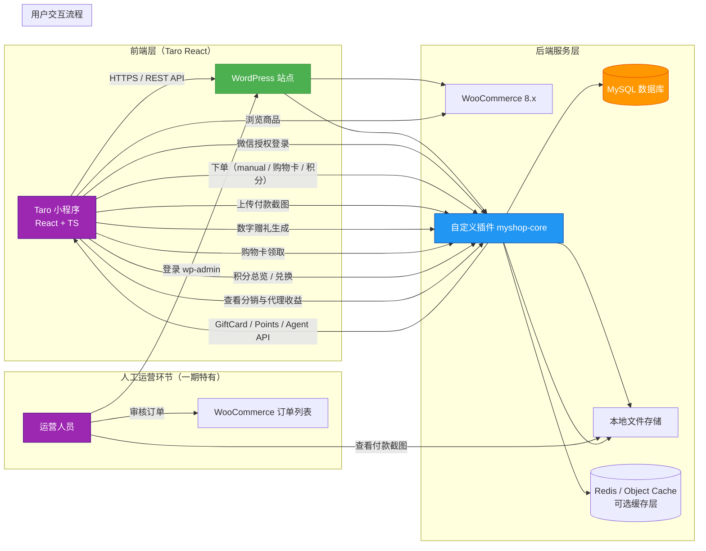
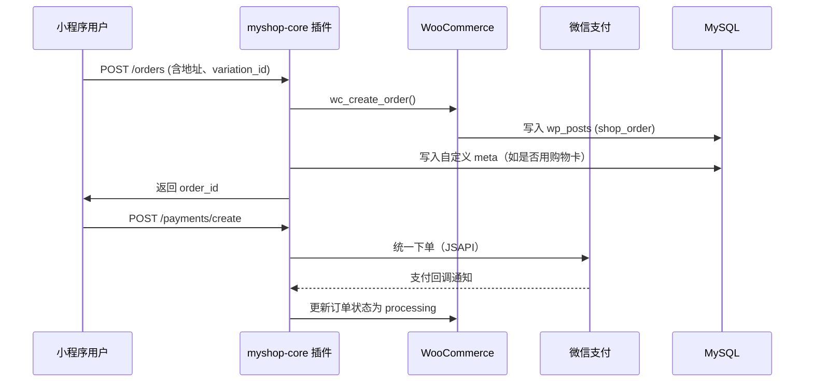
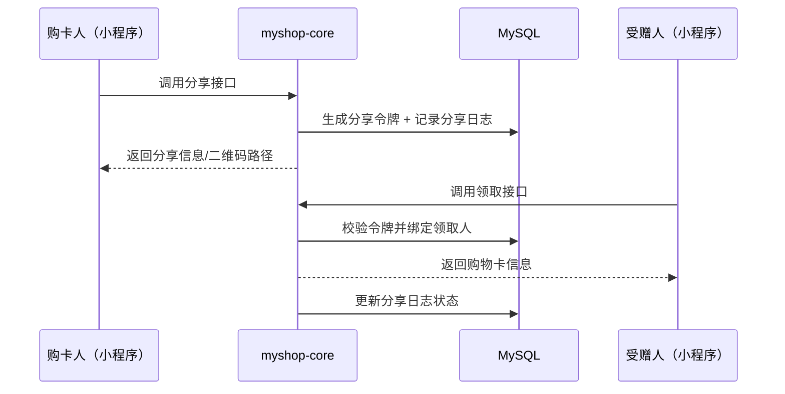

# 🏗️ 系统架构图（System Architecture Diagram）

## 微信小程序 × WordPress 无头电商系统（V2.0 基线）

> **版本**：V2.0（与《功能规格及技术架构说明书》V1.0、《API 接口契约》V2.3、《角色权限矩阵》V2.0 对齐）
> **适用阶段**：一期（人工收款）+ 二期（虚拟购物卡 / 积分 / 分销 / 代理商）
> **目标**：明确组件边界、数据流向、扩展点与安全红线，为前后端落地提供统一蓝图

------

------

## 二、架构说明

> 重大架构调整需先更新本文档，再同步至 API 契约、分阶段开发计划及相关实现代码，确保“文档即基线”。

### 1. **前端层（Frontend）**

- **载体**：微信小程序（Taro 4.1 + React 18 + TypeScript）
- **职责**：
  - 用户交互（登录、浏览、下单、上传凭证、购物卡分享/领取、积分与代理相关页面）
  - 调用 API Base URL 统一接口（封装在 `src/services/api.ts`）
  - 本地状态管理（Token、公共配置、购物车草稿等）
  - 错误映射：`src/utils/error-map.ts` 将 `error_code` 转换为中文提示
- **限制**：
  - 禁止直接调用 `Taro.request`（必须走 service 层）
  - 不缓存敏感数据（购物卡 PIN、一次性分享口令）
  - 不直接访问数据库，所有业务逻辑由后端 API 驱动
- **优势**：
  - AI 友好：函数式组件 + 类型约束 + 目录规范，易于自动生成与回溯
  - 扩展弹性：服务拆分（orders/giftCard/points/agent）可按需延展

> ⚠️ **关键更新**：前端工程规范已与 API 契约 V2.3 对齐，新增虚拟购物卡、积分、代理模块页面模板。

------

### 2. **后端服务层（Backend）**

#### a) **WordPress 核心（v6.5+）**

- 提供用户体系（`wp_users`）、角色权限、REST API 基础框架
- 启用固定链接（Permalinks）以支持干净 URL

#### b) **WooCommerce（v8.x）**

- **核心作用**：
  - 商品管理（变体商品）
  - 订单生命周期（状态流转）
  - 地址、库存、价格计算
- **集成方式**：
  - 自定义插件通过 WooCommerce Hooks 和 Functions 操作订单/商品
  - **绝不修改 WooCommerce 核心文件**

#### c) **自定义插件：`myshop-core`**

- **位置**：`/wp-content/plugins/myshop-core/`

- **核心模块**：

  | 模块                      | 功能                                                         |
  | ------------------------- | ------------------------------------------------------------ |
  | `Auth`                    | JWT 登录、Token 验证                                         |
  | `API Routes`              | 实现所有 `/myshop/v1/...` 接口                               |
  | `Data Model`              | 操作 `usermeta` + 自定义表（`gift_cards`, `commissions` 等） |
  | `WooCommerce Bridge`      | 创建订单、处理购物卡抵扣、上传附件                           |
  | `Agent & Referral Engine` | 处理邀请关系、佣金计算                                       |

- **安全机制**：

  - 所有写操作验证当前用户身份
  - 敏感接口（如重置 PIN）二次校验
  - 输入参数严格过滤（`sanitize_text_field`, `absint` 等）

#### d) **MySQL 数据库**

- 使用 WordPress 默认数据库
- 新增表前缀：`wp_myshop_*`（如 `wp_myshop_gift_cards`）
- 所有业务字段通过 `usermeta` / `postmeta` 扩展，避免修改原生表结构

#### e) **文件存储**

- 付款截图、购物卡 PDF 等存储于 WordPress 默认上传目录（`/wp-content/uploads/`）
- 通过 `wp_handle_upload()` 安全处理上传

------

### 3. **人工运营环节（一期特有）**

- **角色**：运营人员（WordPress 管理员）
- **操作路径**：
  1. 登录 `https://yourdomain.com/wp-admin`
  2. 进入 **WooCommerce > 订单**
  3. 查看状态为 “待确认” 的订单
  4. 点击订单，查看用户上传的付款截图
  5. 手动将订单状态改为 “已完成”
- **自动化触发**：
  - 订单状态变为 “已完成” 时，自动触发佣金计算（通过 `woocommerce_order_status_completed` 钩子）

------

### 4. **关键数据流向示例**

#### a) 微信支付订单（含积分、购物卡抵扣）

------

#### b) 数字购物卡赠礼领取流程

------

### 5. **扩展性设计（面向三期）**

| 三期功能 | 当前预留点                                                   |
| -------- | ------------------------------------------------------------ |
| 微信支付 | 预留 `/payments/wechatpay/notify` 路径；订单支持 `payment_method=wechatpay` |
| 会员等级 | `usermeta.membership_level` 字段已存在                       |
| 自动结算 | `commissions.status` 支持 `paid`，未来可对接打款系统         |
| 多级分销 | `referrals.path` 字段支持任意层级查询                        |
| 消息触达 | 我的积分、购物卡领取写入站内消息队列；后续可对接企业微信推送 |

------

## 三、技术栈清单

| 层级     | 技术/工具              | 版本要求   | 说明               |
| -------- | ---------------------- | ---------- | ------------------ |
| 前端     | 微信小程序             | 最新稳定版 | 原生或兼容框架     |
| 后端     | WordPress              | ≥ 6.5      | 免费开源版         |
| 电商引擎 | WooCommerce            | ≥ 8.0      | 免费插件           |
| 数据库   | MySQL                  | ≥ 5.7      | 或 MariaDB ≥ 10.3  |
| 认证     | JWT (firebase/php-jwt) | 最新版     | 通过 Composer 引入 |
| 开发     | PHP                    | ≥ 7.4      | 推荐 8.0+          |
| 部署     | Nginx/Apache           | -          | 标准 LAMP/LEMP     |

> 💡 **零付费依赖**：全部基于免费 WordPress 生态实现

------

## 四、安全边界

- 🔒 **外部不可访问**：`wp-config.php`、`wp-admin`（除运营人员）
- 🔒 **API 认证**：所有写操作需有效 JWT Token
- 🔒 **文件上传**：仅允许 `.jpg`, `.png`，重命名防覆盖
- 🔒 **SQL 操作**：全部使用 `$wpdb->prepare()` 防注入
- 🔒 **购物卡 PIN**：bcrypt 加密存储，永不明文返回
- 🔒 **分享口令**：一次性或限时有效，领取后立即失效
- 🔒 **积分/代理接口**：超频调用记录 IP + user_id 以备审计

------

**文档版本**：V2.0（系统架构冻结基线）  
**最后更新**：2025年11月22日  
**输出格式**：Markdown + Mermaid（可直接渲染于 Typora / VS Code / GitLab）

------

✅ 下一步建议：
请确认此架构图是否符合你的预期。确认后，我将输出下一份文档：

> **《WordPress 插件开发规范（含目录结构与代码约定）》**

你可以回复：  

> “确认，继续输出 WordPress 插件开发规范。”

