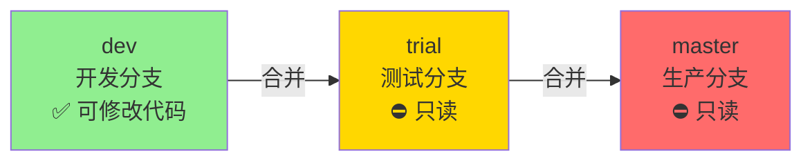

# 🔒 Git 分支管理规范

## 📋 核心原则

### ✅ 单向合并流程（严格执行）

```
dev → trial → master
(开发) → (测试) → (生产)
```

**⚠️ 不可逆转！禁止反向合并！**

---

## 🎯 分支职责

| 分支 | 用途 | 允许操作 | 禁止操作 |
|-----|------|---------|---------|
| **dev** | 开发分支 | ✅ 修改代码<br>✅ 提交代码<br>✅ 推送代码 | ❌ 直接部署到生产 |
| **trial** | 测试分支 | ✅ 合并 dev<br>✅ 触发测试环境部署 | ❌ **直接修改代码**<br>❌ 合并其他分支<br>❌ 反向合并到 dev |
| **master** | 生产分支 | ✅ 合并 trial<br>✅ 触发生产环境部署 | ❌ **直接修改代码**<br>❌ 合并 dev<br>❌ 反向合并 |

---

## 🔄 标准工作流

### 日常开发流程

```bash
# 1. 确保在 dev 分支
git checkout dev

# 2. 开发新功能
# ... 编写代码 ...

# 3. 提交代码
git add .
git commit -m "feat: add new feature"

# 4. 推送到远程（可选）
scripts\push-all.bat dev

# 5. 部署到测试环境（自动合并 dev → trial）
scripts\deploy-trial.bat

# 6. 测试通过后，部署到生产（自动合并 trial → master）
scripts\deploy-prod.bat
```

---

## ⛔ 严格禁止的操作

### ❌ 禁止 1: 在 trial 或 master 分支直接修改代码

```bash
# ❌ 错误示范
git checkout trial
# 修改代码...
git commit -m "fix: bug"  # 🚫 禁止！

# ✅ 正确做法
git checkout dev          # 切回 dev
# 修改代码...
git commit -m "fix: bug"
scripts\deploy-trial.bat  # 通过合并更新 trial
```

### ❌ 禁止 2: 反向合并

```bash
# ❌ 错误示范
git checkout dev
git merge trial    # 🚫 禁止反向合并！

git checkout dev
git merge master   # 🚫 禁止反向合并！

# ✅ 正确做法
# dev 是源头，不应该从下游分支合并
# 如果 trial/master 有紧急修复，应该在 dev 重新开发
```

### ❌ 禁止 3: 跨级合并

```bash
# ❌ 错误示范
git checkout master
git merge dev      # 🚫 禁止跳过 trial！

# ✅ 正确做法
# 必须先合并到 trial 测试，再合并到 master
scripts\deploy-trial.bat   # dev → trial
scripts\deploy-prod.bat    # trial → master
```

---

## 🛡️ 分支保护机制

### 自动检查脚本

项目提供了分支保护检查脚本：

```bash
# Windows
scripts\check-branch-protection.bat

# Linux/macOS
./scripts/check-branch-protection.sh
```

**功能**：
- ✅ 检测当前是否在保护分支（trial/master）
- ✅ 如果在保护分支，显示错误并拒绝操作
- ✅ 提示正确的工作流程

### 集成到 Git Hooks（推荐）

可以将检查添加到 Git pre-commit hook：

```bash
# .git/hooks/pre-commit
#!/bin/bash
./scripts/check-branch-protection.sh || exit 1
```

这样在 trial 或 master 分支尝试提交时会自动阻止。

---

## 🚨 紧急修复（Hotfix）流程

### 场景：生产环境发现严重 Bug

```bash
# ❌ 错误做法：直接在 master 修改
git checkout master
# 修改...  # 🚫 违反规范！

# ✅ 正确做法：在 dev 修复后快速部署

# 1. 在 dev 分支修复
git checkout dev
# 修复 Bug...
git add .
git commit -m "fix(urgent): critical bug"

# 2. 快速推送
scripts\push-all.bat dev

# 3. 部署到测试（快速验证）
scripts\deploy-trial.bat

# 4. 立即部署到生产
scripts\deploy-prod.bat
```

---

## 📊 合并方向图



**关键点**：
- ✅ dev → trial → master（单向）
- ❌ 禁止任何反向合并
- ❌ 禁止跨级合并

---

## 🔍 为什么这样设计？

### 优势

1. **代码质量保证**
   - ✅ 所有代码都经过 dev 开发
   - ✅ 所有代码都经过 trial 测试
   - ✅ 只有测试通过的代码才到 master

2. **历史清晰**
   - ✅ 单向流动，历史线性
   - ✅ 易于追踪和回滚
   - ✅ 便于代码审查

3. **安全性高**
   - ✅ 生产分支不可直接修改
   - ✅ 降低误操作风险
   - ✅ 强制测试流程

4. **协作友好**
   - ✅ 即使单人开发也保持良好习惯
   - ✅ 方便未来团队扩展
   - ✅ 符合行业标准

---

## 📝 检查清单

### 提交代码前检查

- [ ] 当前是否在 dev 分支？
- [ ] 代码是否已本地测试？
- [ ] 提交信息是否符合规范？

### 部署前检查

- [ ] 是否已在 dev 分支提交？
- [ ] 是否先部署到 trial 测试？
- [ ] trial 测试是否通过？
- [ ] 生产部署是否需要确认？

---

## 🔗 相关脚本

| 脚本 | 合并方向 | 用途 |
|-----|---------|------|
| `deploy-trial.bat/sh` | dev → trial | 部署测试环境 |
| `deploy-prod.bat/sh` | trial → master | 部署生产环境 |
| `check-branch-protection.bat/sh` | - | 分支保护检查 |
| `push-all.bat/sh` | - | 双远程推送 |

---

## ⚠️ 违规后果

如果违反了分支规范：

1. **代码混乱**：合并冲突增多
2. **历史复杂**：难以追踪问题
3. **测试绕过**：未测试代码进入生产
4. **回滚困难**：不清楚回滚到哪个版本

---

## 💡 最佳实践建议

1. **永远在 dev 开发**
   - 即使是小改动也在 dev 完成

2. **使用脚本部署**
   - 避免手动合并出错
   - 保证流程一致性

3. **测试后再上线**
   - 必经 trial 验证
   - 降低生产风险

4. **添加分支保护**
   - 使用 Git Hooks
   - 自动阻止违规操作

---

## 🎯 总结

**核心规范**：
```
✅ dev 分支：唯一可以修改代码的分支
⛔ trial 分支：只能通过合并 dev 更新
⛔ master 分支：只能通过合并 trial 更新
🔄 合并方向：dev → trial → master（单向，不可逆）
```

这是**严格且正确**的分支管理规范，请务必遵守！🔒
