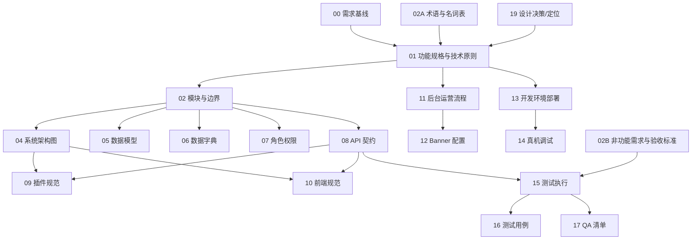

# 文档主索引与引用关系

> **目标**：一眼看清“唯一出处”和引用链路，避免重复定义与冲突。

---

## 一、唯一出处（Single Source of Truth）

| 主题 | 唯一出处 |
| --- | --- |
| 需求基线 | `docs/00_需求理解对齐文档_v2.1_最终版.md` |
| 功能规格与技术原则 | `docs/01_功能规格及技术架构说明书_v1.0.md` |
| 模块与边界 | `docs/02_模块与边界定义_v1.0.md` |
| 术语与名词 | `docs/02A_术语与名词表_v1.0.md` |
| 非功能需求与验收标准 | `docs/02B_非功能需求与验收标准_v1.0.md` |
| 架构与数据流 | `docs/04_系统架构图_v2.0.md` |
| 数据模型 | `docs/05_DATA_MODEL_v2.1.md` |
| 字段/类型/含义 | `docs/06_DATA_DICTIONARY_v1.2.md` |
| 角色与权限 | `docs/07_ROLE_MATRIX_v2.0.md` |
| API 契约/错误码/状态 | `docs/08_API_CONTRACT_V2.3.md` |
| 后端插件规范 | `docs/09_PLUGIN_SPEC_v1.1.md` |
| 前端工程规范 | `docs/10_MINIPROGRAM_SPEC_v2.0.md` |
| 后台运营流程 | `docs/11_WORDPRESS_ADMIN_GUIDE.md` |
| 运营配置（Banner） | `docs/12_BANNER_MANAGEMENT_GUIDE.md` |
| 本地开发环境 | `docs/13_LARAGON_DEPLOY_GUIDE.md` |
| 真机调试 | `docs/14_REAL_DEVICE_DEBUG_GUIDE.md` |
| 测试执行 | `docs/15_测试执行指南.md` |
| 测试用例 | `docs/16_测试用例文档.md` |
| QA 检查清单 | `docs/17_QA_POSTMAN_CHECKLIST.md` |
| 提交规范 | `docs/18_git-commit-guidelines.md` |
| 设计决策（ADR） | `docs/19_礼品卡定位分析.md` |
| 用户使用手册 | `docs/20_USER_GUIDE.md` |
| 管理人员使用手册 | `docs/21_ADMIN_USER_GUIDE.md` |
| 页面帮助文案清单 | `docs/22_HELP_TOOLTIP_COPY.md` |
| 页面帮助文案映射 | `docs/23_HELP_TOOLTIP_MAP.md` |
| 页面帮助文案 CSV | `docs/24_HELP_TOOLTIP_COPY.csv` |
| 页面帮助文案 JSON | `docs/25_HELP_TOOLTIP_COPY.json` |
| Git 自动化部署指南 | `docs/26_GIT_AUTOMATION_GUIDE.md` |
| Git 分支管理规范 | `docs/27_BRANCH_MANAGEMENT_RULES.md` |

---

## 二、前后端入口

- 前端入口：`docs/frontend/README.md`
- 后端入口：`docs/backend/README.md`

---

## 三、引用关系（从需求到实现）



---

## 四、使用规则

1. **禁止在非唯一出处中重复定义**：字段、状态、错误码、权限、接口与模块边界只允许在唯一出处存在。
2. **新增功能必须顺序更新**：`00/01/02` → `08 API` → `09/10 实现规范` → `15/16/17 测试`。
3. **文档引用必须显式**：任何文档内的规则必须链接到唯一出处文件。
4. **严格流程链路**：用户需求 → 产品需求 → 架构设计 → 技术实现 → 测试 → 文档与代码回归对齐。
5. **问题先对文档**：文档错误先修文档再改代码；代码错误按技术文档修代码并补清晰注释。
6. **先文档后代码**：任何新增功能必须先完成文档对齐再开发。
7. **测试门槛**：完成任一功能必须通过单元/接口测试，再进入阶段性真机测试。

---

## 五、开发与部署

### 🚀 自动化部署脚本

项目提供了一套自动化脚本，简化 Git 操作和部署流程：

| 脚本 | 功能 | 平台 |
|-----|------|------|
| `scripts/push-all.*` | 同时推送到 Gitee 和 GitHub | Windows / Linux / macOS |
| `scripts/deploy-trial.*` | 部署到测试环境（Trial） | Windows / Linux / macOS |
| `scripts/deploy-prod.*` | 部署到生产环境（Prod） | Windows / Linux / macOS |

**详细使用说明**: 参见 `scripts/README.md`

### 快速开始

#### Windows 用户
```cmd
# 推送当前分支到双远程
scripts\push-all.bat

# 部署到测试环境
scripts\deploy-trial.bat

# 部署到生产环境（需要确认）
scripts\deploy-prod.bat
```

#### Linux/macOS 用户
```bash
# 首次使用：添加执行权限
chmod +x scripts/*.sh

# 推送当前分支到双远程
./scripts/push-all.sh

# 部署到测试环境
./scripts/deploy-trial.sh

# 部署到生产环境（需要确认）
./scripts/deploy-prod.sh
```

### 典型开发流程

```bash
# 1. 在 dev 分支开发
git checkout dev
# ... 编码和测试 ...

# 2. 提交并推送
git add .
git commit -m "feat: add new feature"
./scripts/push-all.sh dev

# 3. 部署到测试环境（自动合并 dev → trial）
./scripts/deploy-trial.sh

# 4. 测试通过后部署到生产（自动合并 trial → master）
./scripts/deploy-prod.sh
```

### 部署架构

```
本地开发 (dev)
    ↓ [scripts/push-all.sh]
    ├─→ Gitee (备份 + Webhook)
    └─→ GitHub (备份)
    
    ↓ [scripts/deploy-trial.sh]
    
Trial 分支
    ↓ [Gitee Push]
    → 宝塔 Webhook → Trial 站点自动部署
    
    ↓ [scripts/deploy-prod.sh]
    
Master 分支
    ↓ [Gitee Push]
    → 宝塔 Webhook → Prod 站点自动部署
```

### 注意事项

- ✅ 所有脚本会自动同步 Gitee 和 GitHub
- ✅ deploy 脚本会自动切回 dev 分支
- ✅ 生产部署需要手动确认
- ✅ 推送失败会立即终止，不会继续后续操作
- ⚠️ 确保宝塔 Webhook 已正确配置

