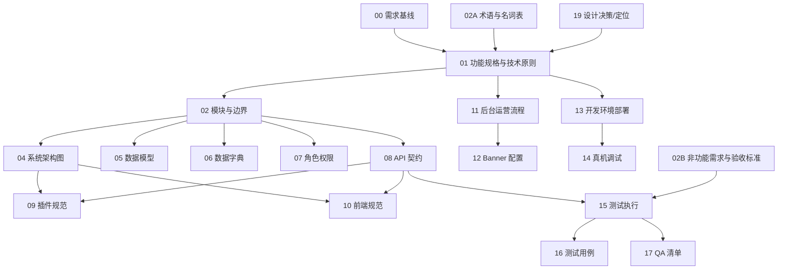

# 文档主索引与引用关系

> **目标**：一眼看清“唯一出处”和引用链路，避免重复定义与冲突。

---

## 一、唯一出处（Single Source of Truth）

| 主题 | 唯一出处 |
| --- | --- |
| 需求基线 | `docs/00_需求理解对齐文档_v2.1_最终版.md` |
| 功能规格与技术原则 | `docs/01_功能规格及技术架构说明书_v1.0.md` |
| 模块与边界 | `docs/02_模块与边界定义_v1.0.md` |
| 术语与名词 | `docs/02A_术语与名词表_v1.0.md` |
| 非功能需求与验收标准 | `docs/02B_非功能需求与验收标准_v1.0.md` |
| 架构与数据流 | `docs/04_系统架构图_v2.0.md` |
| 数据模型 | `docs/05_DATA_MODEL_v2.1.md` |
| 字段/类型/含义 | `docs/06_DATA_DICTIONARY_v1.2.md` |
| 角色与权限 | `docs/07_ROLE_MATRIX_v2.0.md` |
| API 契约/错误码/状态 | `docs/08_API_CONTRACT_V2.3.md` |
| 后端插件规范 | `docs/09_PLUGIN_SPEC_v1.1.md` |
| 前端工程规范 | `docs/10_MINIPROGRAM_SPEC_v2.0.md` |
| 后台运营流程 | `docs/11_WORDPRESS_ADMIN_GUIDE.md` |
| 运营配置（Banner） | `docs/12_BANNER_MANAGEMENT_GUIDE.md` |
| 本地开发环境 | `docs/13_LARAGON_DEPLOY_GUIDE.md` |
| 真机调试 | `docs/14_REAL_DEVICE_DEBUG_GUIDE.md` |
| 测试执行 | `docs/15_测试执行指南.md` |
| 测试用例 | `docs/16_测试用例文档.md` |
| QA 检查清单 | `docs/17_QA_POSTMAN_CHECKLIST.md` |
| 提交规范 | `docs/18_git-commit-guidelines.md` |
| 设计决策（ADR） | `docs/19_礼品卡定位分析.md` |

---

## 二、前后端入口

- 前端入口：`docs/frontend/README.md`
- 后端入口：`docs/backend/README.md`

---

## 三、引用关系（从需求到实现）

---

## 四、使用规则

1. **禁止在非唯一出处中重复定义**：字段、状态、错误码、权限、接口与模块边界只允许在唯一出处存在。
2. **新增功能必须顺序更新**：`00/01/02` → `08 API` → `09/10 实现规范` → `15/16/17 测试`。
3. **文档引用必须显式**：任何文档内的规则必须链接到唯一出处文件。

