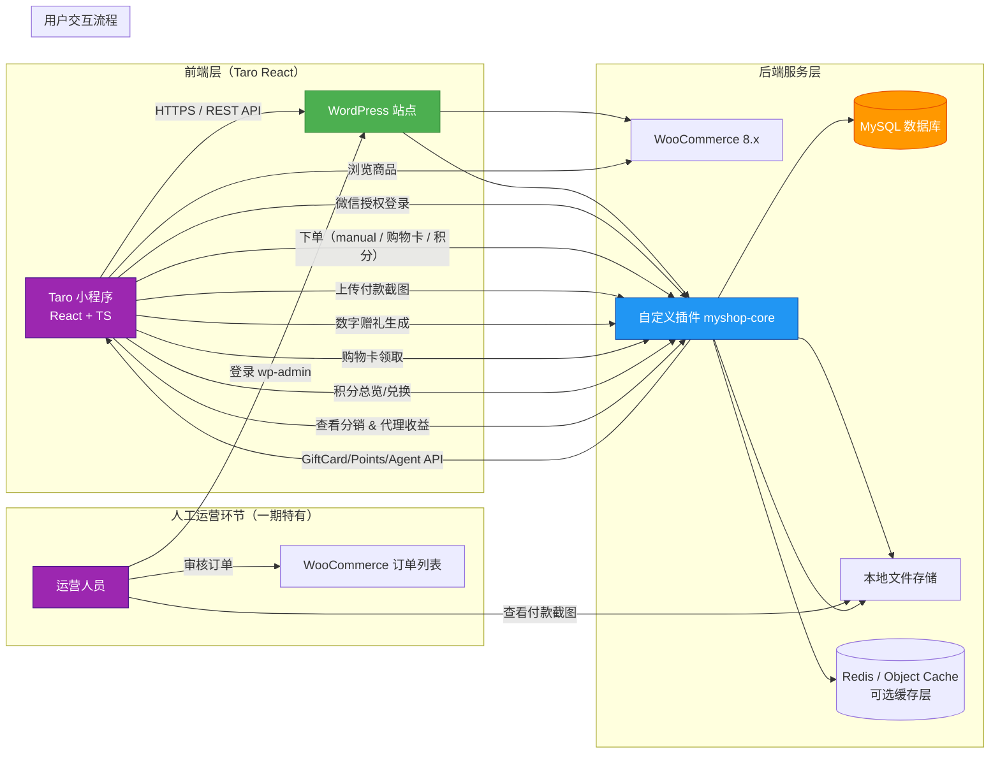
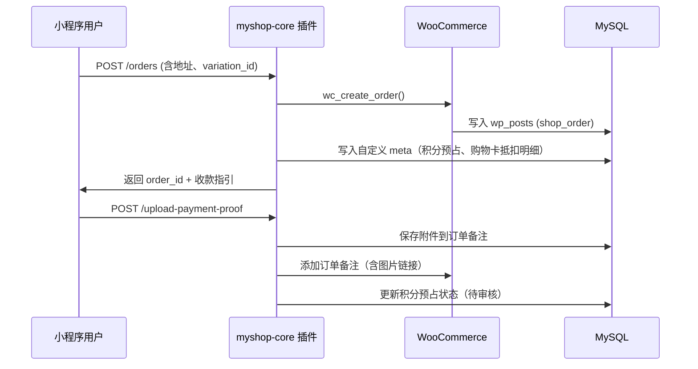

------

# 🏗️ 系统架构图（System Architecture Diagram）

## 微信小程序 × WordPress 无头电商系统（V2.0 基线）

> **版本**：V2.0（同步功能规格 V1.0・API 契约 V2.3・角色矩阵 V2.0）
> **适用阶段**：一期（人工收款） + 二期（虚拟购物卡 / 积分 / 分销 / 代理商）
> **目标**：清晰展示组件边界、数据流向、扩展点与安全边界，为前后端落地提供统一蓝图  



## 二、架构说明

### 1. **前端层（Frontend）**

- **载体**：Taro 4.1 + React 18 + TypeScript（编译为微信小程序）
- **职责**：
  - 用户交互：登录、浏览商品、下单、付款证明、虚拟购物卡赠礼/领取、积分兑换、代理仪表盘
  - 调用 `/wp-json/myshop/v1/...` 统一接口；封装于 `src/services/api.ts` + `endpoints.ts`
  - 本地状态：使用 React Hooks/Context 保存 Token、缓存公共配置、购物车草稿
  - 错误映射：`src/utils/error-map.ts` 将后端 `error_code` 转换为中文提示
- **限制**：
  - 禁止直接调用 `Taro.request`（必须走 service 层）
  - 页面不得缓存敏感数据（购物卡 PIN、一次性口令）
- **优势**：
  - **AI 友好**：函数式组件 + 类型约束 + 目录规范，易于自动生成与回溯
  - **扩展弹性**：服务拆分（orders/giftCard/points/agent）可按需延展，支持分包与多端输出

> ⚠️ **关键更新**：新增虚拟购物卡、积分、代理模块组件库与页面模板，均与 V2.0 工程规范对齐。

------

### 2. **后端服务层（Backend）**

#### a) **WordPress 核心（v6.5+）**

- 提供用户体系（`wp_users`）、角色权限、REST API 基础框架
- 启用固定链接（Permalinks）以支持干净 URL

#### b) **WooCommerce（v8.x）**

- **核心作用**：
  - 商品管理（变体商品）
  - 订单生命周期（状态流转）
  - 地址、库存、价格计算
- **集成方式**：
  - 自定义插件通过 WooCommerce Hooks 和 Functions 操作订单/商品
  - **绝不修改 WooCommerce 核心文件**

#### c) **自定义插件：`myshop-core`**

- **位置**：`wp-content/plugins/myshop-core/`
- **核心子系统**：

  | 子系统                      | 核心职责                                                     | 关联数据表/结构                                       |
  | --------------------------- | ------------------------------------------------------------ | ----------------------------------------------------- |
  | Auth & Session              | JWT 签发、刷新、注销                                         | `wp_users` / `wp_usermeta`                             |
  | Public Config               | 首页运营位、客服信息、支付说明                               | `wp_options`                                           |
  | Orders & Payment Proof      | 创建订单、手动收款流程、凭证上传、购物卡/积分抵扣            | WooCommerce 原生表 + `wp_postmeta` + 附件库            |
  | Gift Card Engine            | 模板管理、卡号生成、数字赠礼、口令校验、核销、日志追踪       | `wp_myshop_gift_cards` / `wp_myshop_gift_card_redemptions` / `wp_myshop_gift_card_share_logs` |
  | Points Engine               | 积分计算、预占、释放、排行榜                                 | `wp_usermeta.total_points` / `wp_myshop_point_ledger`  |
  | Referral & Commission       | 邀请链路、佣金累计、结算、明细导出                           | `wp_myshop_referrals` / `wp_myshop_commissions`        |
  | Agent Console               | 代理入驻、审批、仪表盘指标、下级查询、操作审计               | `wp_myshop_agents` / `wp_myshop_agent_audit_logs`      |

- **安全机制**：

  - 所有写操作校验 JWT + 数据归属；支持 `FOR`/`AGENT_NOT_APPROVED` 等专用错误码
  - 敏感接口（PIN 重置、分享口令）使用二次验证码 / 一次性 token
  - 参数过滤：`sanitize_text_field`、`absint`、`wp_verify_nonce` 等组合
  - 错误统一返回 `{ error_code, message }`，便于前端映射提示

#### d) **MySQL 数据库**

- 使用 WordPress 默认数据库
- 新增表前缀：`wp_myshop_*`（如 `wp_myshop_gift_cards`）
- 所有业务字段通过 `usermeta` / `postmeta` 扩展，避免修改原生表结构

#### e) **文件存储**

- 付款截图、购物卡 PDF 等存储于 WordPress 默认上传目录（`/wp-content/uploads/`）
- 通过 `wp_handle_upload()` 安全处理上传
- 可选启用对象缓存（Redis/Memcached）提升 `/config/public`、积分排行榜等接口响应速度，统一封装在插件内部

------

### 3. **人工运营环节（一期特有）**

- **角色**：运营人员（WordPress `administrator`）
- **操作路径**：
  1. 登录 `https://yourdomain.com/wp-admin`
  2. 进入 **WooCommerce > 订单**
  3. 查看状态为 “待确认” 的订单
  4. 打开订单备注查看用户上传的付款截图
  5. 改为 “已完成” 后触发：购物卡生成 / 积分入账 / 分销佣金预结算
- **二期新增运营动作**：
  - 审核代理商申请、调整等级（`MyShop > 代理商`）
  - 处理购物卡锁定/解锁、PIN 重置人工兜底
  - 定期导出积分、佣金报表对账

------

### 4. **关键数据流向示例**

#### a) 手动收款订单（含积分、购物卡抵扣）



  #### b) 数字购物卡赠礼领取流程

  ```mermaid
  sequenceDiagram
    participant Buyer as 购卡人（小程序）
    participant API as myshop-core
    participant DB as MySQL
    participant Recipient as 受赠人（小程序）

    Buyer->>API: POST /gift-cards/{id}/share
    API->>DB: 生成 share_token + 记录 share_logs
    API-->>Buyer: 返回一次性口令 / 小程序码路径
    Recipient->>API: POST /gift-cards/claim (token, phone)
    API->>DB: 校验 token & 绑定 redeemer_id
    API-->>Recipient: 返回购物卡信息 + 是否需设置 PIN
    API->>DB: 更新 share_logs 状态 + 记录领取时间
  ```

------

### 5. **扩展性设计（面向三期）**

| 三期能力         | 当前预留点                                                     |
| ---------------- | ---------------------------------------------------------------- |
| 微信支付         | 保留 `/payments/wechatpay/notify` Webhook；订单支持 `payment_method=wechatpay` |
| 会员等级         | `usermeta.membership_level` 字段已存在；前端保留入口占位             |
| 自动结算         | `wp_myshop_commissions.status` 支持 `pending/approved/paid`         |
| 多级分销         | `wp_myshop_referrals.path` 字段记录完整树链；接口已在二期兼容         |
| 消息触达（企微） | 我的积分、购物卡领取写入站内消息队列；后续可对接企业微信推送         |

------

## 三、技术栈清单

| 层级     | 技术/工具              | 版本要求 | 说明               |
| -------- | ---------------------- | -------- | ------------------ |
| 前端     | Taro + React           | ≥ 4.1    | 编译为微信小程序   |
|          | TypeScript             | ≥ 5.4    | 强类型约束         |
|          | React Hooks/Context    | —        | 管理 Token / 全局态 |
| 后端     | WordPress              | ≥ 6.5    | 免费开源版         |
| 电商引擎 | WooCommerce            | ≥ 8.0    | 免费插件           |
| 数据库   | MySQL                  | ≥ 5.7    | 或 MariaDB ≥ 10.3  |
| 认证     | JWT (firebase/php-jwt) | 最新版   | 通过 Composer 引入 |
| 开发     | PHP                    | ≥ 7.4    | 推荐 8.0+          |
| 部署     | Nginx/Apache           | -        | 标准 LAMP/LEMP     |

> 💡 **零付费依赖**：全部基于免费 WordPress 生态实现

------

## 四、安全边界

- 🔒 **外部不可访问**：`wp-config.php`、`wp-admin`（除运营人员）
- 🔒 **API 认证**：所有写操作需有效 JWT Token
- 🔒 **文件上传**：仅允许 `.jpg`, `.png`，重命名防覆盖
- 🔒 **SQL 操作**：全部使用 `$wpdb->prepare()` 防注入
- 🔒 **购物卡口令/PIN**：口令仅一次有效；PIN bcrypt 加密存储，不在日志中输出
- 🔒 **积分 & 代理接口**：超频调用记录 IP + user_id 以备风控审计

------

**文档版本**：V2.0
**最后更新**：2025年11月22日
**输出格式**：Markdown + Mermaid（可直接渲染于 Typora / VS Code / GitLab）

------