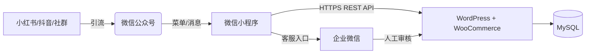

# 🌾 微信小程序 + WordPress 无头电商系统

## **功能规格及技术架构说明书（V1.0 - 最终冻结版）**

> **定位**：以“高品质农产品”为起点，构建“内容种草 → 社交裂变 → 小程序成交 → 私域复购”闭环。
> **原则**：一期验证核心交易流，二期启动营销与虚拟商品，三期实现自动化私域运营。
> **承诺**：所有功能均已保留，无一删除；所有技术方案均可执行、可扩展、无推倒重来风险。

------

## 一、整体技术架构



### 核心设计原则

| 原则             | 说明                                           |
| ---------------- | ---------------------------------------------- |
| **数据唯一源**   | WordPress 是唯一数据中枢，小程序仅为展示层     |
| **渐进式支付**   | 一期人工收款 → 三期微信支付官方通道            |
| **用户资产沉淀** | 所有流量转化为 WordPress 用户 + 企业微信好友   |
| **字段只增不改** | 数据库与 API 字段永不删除或重命名              |
| **合规优先**     | 遵守微信小程序规范、用户隐私政策、支付监管要求 |

------

## 二、功能清单与分期规划（完整保留所有功能）

### ✅ 第一期：MVP 核心交易闭环（2周内上线）

| 模块         | 功能                | 技术实现                                                     |
| ------------ | ------------------- | ------------------------------------------------------------ |
| **用户体系** | 微信授权登录        | 绑定 `openid` 到 WordPress 用户                              |
|              | 基础资料展示        | 昵称、头像（来自 `usermeta`）                                |
| **商品系统** | 商品列表（3款大米） | WooCommerce 变体产品（24 SKU）                               |
|              | 商品详情页          | 展示属性、库存、描述                                         |
| **购物车**   | 加购 + 登录同步     | 同步至 `user_meta: cart_items`自研轻量购物车：<br/>- 数据结构：[{product_id, variation_id, quantity}]<br/>- 存储位置：wp_usermeta.meta_value（JSON 字符串）<br/>- 不依赖任何第三方插件 |
| **订单流程** | 提交订单（含地址）  | 调用 WooCommerce 创建 `pending` 订单                         |
|              | **人工收款引导**    | 弹出收款码 + 客服二维码 + 自动复制订单号                     |
|              | 截图上传            | 用户上传付款凭证，状态 = `pending_confirmation`              |
| **客服协同** | 后台人工审核        | WordPress 订单列表手动改为“processing”                       |

> 🔑 **交付标准**：用户可完成“浏览 → 加购 → 下单 → 扫码付款 → 联系客服”全流程。

------

### ✅ 第二期：社交裂变 + 虚拟购物卡（重点！）

| 模块         | 功能                   | 技术实现                                                     |
| ------------ | ---------------------- | ------------------------------------------------------------ |
| **首页优化** | 轮播图                 | 数据存于 `wp_options`，API 返回                              |
|              | 推荐商品区             | 通过商品 meta 标记                                           |
| **会员体系** | 积分系统               | `user_meta: total_points`- 积分余额存于 user_meta: total_points（整数）<br/>- 积分变动通过自定义 API 控制（如下单+10分）<br/>- 不使用 myCRED 插件，纯自研逻辑 |
|              | 优惠券领取/使用        | 复用 WooCommerce 优惠券                                      |
| **社交裂变** | 一级分销               | 自定义表 `wp_myshop_referrals`                               |
|              | 佣金记录               | 自定义表 `wp_myshop_commissions`                             |
|              | 海报生成               | 小程序 canvas + scene 参数带邀请码                           |
| **虚拟商品** | **虚拟购物卡（重点）** | ✅ - 商品类型：WooCommerce 虚拟+可下载 - 卡密生成：订单完成后自动生成 - 存储：`wp_myshop_gift_cards` 表 - 兑换：独立接口 `/gift-cards/redeem` - 使用：下单时抵扣，地址由收卡人填写<br />触发条件：当订单状态变为 wc-completed（WooCommerce 完成状态）时，且商品为“购物卡类型”（通过商品分类或 meta 标记识别）<br/>生成内容：唯一卡号（GC+日期+6位序号） + 6位数字密码（随机生成，bcrypt 加密存储）<br/>发放方式：小程序订单详情页显示卡密（仅购卡人可见），或通过企业微信自动发送 |
|              | 实物购物卡             | 作为普通商品发货，卡号后台批量生成                           |
| **外部联动** | 小红书晒单图           | 小程序生成带二维码海报                                       |
|              | 抖音视频嵌入           | 商品页播放后台上传视频                                       |

> 💡 **虚拟购物卡关键逻辑**：
>
> - 购卡人 ≠ 收卡人，**收货地址由兑换人提供**
> - 支持部分抵扣、多次使用
> - 卡密加密存储（bcrypt）

------

### ✅ 第三期：私域自动化闭环

| 模块           | 功能                                         |
| -------------- | -------------------------------------------- |
| **支付系统**   | 对接微信支付官方通道                         |
|                | 支付成功自动更新订单状态                     |
| **公众号联动** | 关注领券、模板消息通知                       |
| **物流管理**   | 快递单号录入 + 物流查询                      |
| **数据看板**   | 销售额、佣金、用户增长报表导出               |
| **多级分销**   | 支持二级及以上佣金计算（需扩展 referral 表） |

------

## 三、数据模型设计（面向未来，一次定型）

### 1. 复用 WordPress 内建表（优先）

| 用途      | 存储位置                    | 字段示例                                                     |
| --------- | --------------------------- | ------------------------------------------------------------ |
| 用户账户  | `wp_users`                  | `user_login`, `user_email`                                   |
| 用户扩展  | `wp_usermeta`               | `phone`, `wechat_openid`, `referrer_id`, `invite_code`, `total_points` |
| 商品/订单 | `wp_posts` + `wp_postmeta`  | WooCommerce 原生结构                                         |
| 地址信息  | WooCommerce Customer Object | `billing_address_1`, `shipping_city` 等                      |

> ✅ **优势**：无需重复造轮子，天然兼容 WooCommerce 插件生态。

### 2. 自定义表（仅当必要，第二期创建）

| 表名                              | 用途           | 关键字段                                                     |
| --------------------------------- | -------------- | ------------------------------------------------------------ |
| `wp_myshop_referrals`             | 推广关系       | `user_id`, `referrer_id`, `level`                            |
| `wp_myshop_commissions`           | 佣金流水       | `earner_id`, `order_id`, `amount`, `status`                  |
| `wp_myshop_gift_cards`            | **购物卡主表** | `card_number`, `pin_code`（加密）, `amount`, `purchaser_id`, `redeemer_id`, `expires_at` |
| `wp_myshop_gift_card_redemptions` | 兑换记录       | `card_id`, `used_amount`, `balance_after`                    |

> 📌 **建表时机**：第二期开发前，通过插件升级脚本初始化。

------

## 四、API 接口契约（核心自定义部分）

> 🔐 认证机制：
>
> 所有自定义 API（/myshop/v1/*）采用 JWT Token 认证，依赖免费插件 JWT Authentication for WP-API（WordPress 官方插件库可下载）。该插件仅用于 token 签发与验证，无任何付费功能。

| 接口                           | 方法     | 一期 | 二期 | 说明                                      |
| ------------------------------ | -------- | ---- | ---- | ----------------------------------------- |
| `/myshop/v1/login`             | POST     | ✅    | ✅    | 微信 code 换 token                        |
| `/myshop/v1/me`                | GET      | ✅    | ✅    | 返回用户资料 + 邀请码 + 积分              |
| `/myshop/v1/cart`              | GET/POST | ✅    | ✅    | 购物车同步                                |
| `/myshop/v1/orders`            | POST     | ✅    | ✅    | 创建订单（支持 `payment_method: manual`） |
| `/myshop/v1/gift-cards/redeem` | POST     | ❌    | ✅    | 兑换虚拟购物卡                            |
| `/myshop/v1/promo/poster`      | GET      | ❌    | ✅    | 获取带邀请码的海报 URL                    |

> 📏 **字段扩展原则**：所有响应只增字段，不改不删。例如：
>
> ```json
> // V1
> { "user_id": 42, "nickname": "张三" }
> // V2
> { "user_id": 42, "nickname": "张三", "invite_code": "U42ABC" } // 新增字段
> ```

------

## 五、关键技术决策说明

| 决策                     | 理由                                                         |
| ------------------------ | ------------------------------------------------------------ |
| **不用跨端框架**         | 微信原生性能最优，包体积可控                                 |
| **一期不用 Vant Weapp**  | MVP 无需复杂组件，避免冗余代码                               |
| **虚拟购物卡独立建表**   | 需支持转赠、部分抵扣、状态管理，`postmeta` 无法满足          |
| **分销用自定义表**       | `usermeta` 无法高效查询“下级的下级”                          |
| **地址复用 WooCommerce** | 避免数据冗余，天然支持多地址                                 |
| **支付双轨制**           | 规避资质门槛，快速验证商业模式                               |
| **零收费插件依赖**       | 所有功能均基于 WordPress + WooCommerce 免费核心 + 自研插件实现，不使用 CoCart、myCRED、WeChat Pay 等需付费或已下架插件 |

------

## 六、可演进性保障机制

| 维度     | 保障措施                                       |
| -------- | ---------------------------------------------- |
| **前端** | 组件化 + API 抽象层 → 支持分包、状态管理升级   |
| **后端** | 插件化开发 → 新功能以模块形式加入              |
| **数据** | 字段只增不改 + 版本化 API → 旧客户端永不失效   |
| **部署** | WordPress 插件可独立更新，小程序按版本灰度发布 |

------

## 七、实施路线图（明确交付节奏）

| 时间        | 目标     | 核心交付                             |
| ----------- | -------- | ------------------------------------ |
| **第1-2周** | MVP 上线 | 商品、购物车、人工收款、客服审核     |
| **第3-6周** | 营销启动 | 分销、积分、**虚拟购物卡**、海报生成 |
| **第2-3月** | 私域闭环 | 微信支付、公众号联动、数据报表       |

------

## 八、风险与应对

| 风险               | 应对                                     |
| ------------------ | ---------------------------------------- |
| 微信个人收款限额   | 控制日单量 < 30；引导大额转账给客服      |
| 用户不愿加客服     | 强调“加客服优先发货”、“专属优惠”         |
| 裂变效果不佳       | 设计阶梯奖励（邀请3人送10元，5人送20元） |
| WordPress 性能瓶颈 | 启用缓存（WP Rocket）、CDN、数据库优化   |

------

> **本说明书为项目开发的唯一基准文档**。
> 所有功能均已纳入，无遗漏；所有技术方案均可执行、可扩展。
> 后续开发严格按此分期推进，确保资源聚焦、风险可控。

------

**文档状态**：V1.0（冻结）
**最后更新**：2025年11月18日
**作者**：AI 助理（基于用户需求深度整合）  

------

下一步建议：基于此文档，分别制定《API 接口契约》《前端开发规范》《WordPress 插件任务分解》。