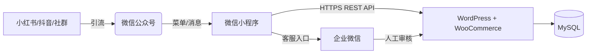

# 🌾 微信小程序 + WordPress 无头电商系统

## **功能规格及技术架构说明书（V1.0 - 最终冻结版）**

> **定位**：以“高品质农产品”为起点，构建“内容种草 → 社交裂变 → 小程序成交 → 私域复购”闭环。
> **原则**：一期验证核心交易流，二期启动营销与虚拟商品，三期实现自动化私域运营。
> **承诺**：所有功能均已保留，无一删除；所有技术方案均可执行、可扩展、无推倒重来风险。

------

## 一、整体技术架构



### 核心设计原则

| 原则             | 说明                                           |
| ---------------- | ---------------------------------------------- |
| **数据唯一源**   | WordPress 是唯一数据中枢，小程序仅为展示层     |
| **渐进式支付**   | 一期人工收款 → 三期微信支付官方通道            |
| **用户资产沉淀** | 所有流量转化为 WordPress 用户 + 企业微信好友   |
| **字段只增不改** | 数据库与 API 字段永不删除或重命名              |
| **合规优先**     | 遵守微信小程序规范、用户隐私政策、支付监管要求 |

------

## 二、功能清单与分期规划（完整保留所有功能）

### ✅ 第一期：MVP 核心交易闭环（2周内上线）

| 模块         | 功能                  | 技术实现                                                     |
| ------------ | --------------------- | ------------------------------------------------------------ |
| **用户体系** | 微信授权登录          | 绑定 `openid` 到 WordPress 用户                              |
|              | 基础资料展示          | 昵称、头像（来自 `usermeta`）                                |
| **营销引擎** | **邀请裂变最小闭环**  | 提供专属邀请码 + 场景码；落地页记录渠道参数；小程序端展示邀请统计 |
|              | **首页营销位管理**    | 后台 `wp_options` + Elementor 模板管理轮播/推荐区；提供 `/config/public` 接口给前端读取 |
| **商品系统** | 商品列表（3款大米）   | WooCommerce 变体产品（24 SKU）                               |
|              | 商品详情页            | 展示属性、库存、描述                                         |
| **购物车**   | 加购 + 登录同步       | 同步至 `user_meta: cart_items` 自研轻量购物车：<br/>- 数据结构：[{product_id, variation_id, quantity}]<br/>- 存储位置：wp_usermeta.meta_value（JSON 字符串）<br/>- 所有增删改通过后端接口串行处理 |
| **订单流程** | 提交订单（含地址）    | 调用 WooCommerce 创建 `pending` 订单                         |
|              | **人工收款引导**      | 弹出收款码 + 客服二维码 + 自动复制订单号                     |
|              | 截图上传              | 用户上传付款凭证，状态 = `pending_confirmation`              |
| **客服协同** | 后台人工审核 + 备注流 | WordPress 订单列表手动改为“processing”，并使用订单备注记录审核过程 |

> 🔑 **交付标准**：用户可完成“浏览 → 加购 → 下单 → 扫码付款 → 联系客服”全流程。

------

### ✅ 第二期：社交裂变 + 虚拟购物卡（重点！）

| 模块         | 功能                     | 技术实现                                                     |
| ------------ | ------------------------ | ------------------------------------------------------------ |
| **首页运营** | 运营位进阶               | 运营可通过后台配置 banner/推荐/活动区排序与跳转，实时下发到 `/config/public` |
|              | 内容营销入口             | 后台可上传图文/视频素材，首页/详情页动态挂载                 |
| **会员体系** | 积分系统                 | `user_meta: total_points` 存总分；新增表 `wp_myshop_point_ledger` 记录明细（earn/spend/adjust/expire）；支持积分有效期、即将过期提醒；自研 API 提供积分总览、流水分页、订单抵扣预占与释放 |
|              | 优惠券领取/使用          | 复用 WooCommerce 优惠券，定义与积分互斥/叠加规则             |
| **社交裂变** | 一级分销（正式版）       | 自定义表 `wp_myshop_referrals` 存邀请关系；提供邀请码、渠道统计、层级同步 |
|              | 佣金政策配置 + 结算流程  | 自定义表 `wp_myshop_commissions`；后台配置一级/二级比例、提现门槛；佣金状态 `pending → approved → paid` |
|              | 海报生成                 | 小程序 canvas + scene 参数带邀请码；提供后台模板管理         |
| **虚拟商品** | **虚拟购物卡（重点）**   | ✅ - 商品类型：WooCommerce 虚拟 + 可下载<br/>- 模板类型：① **储值卡**（任意金额）② **固定组合卡**（后台配置 SKU 组合）③ **任意组合卡**（用户自由搭配）<br/>- 购卡流程：订单完成后自动生成卡片，仅记录模板/金额/快照，不产生祝福语<br/>- 分享流程：用户在卡包中选择卡 → 选择后台配置的模板图案 → 可沿用/编辑/清空祝福语 → 生成数字分享二维码 + 可下载 PDF（同一模板）<br/>- 领取流程：受赠人长按/扫码 → 登录 → 确认提示页 → 自动入库 → 跳转“我的”页面<br/>- 使用方式：储值卡在购物车/支付页抵扣；固定/任意组合卡触发 0 元兑换订单；所有兑换动作写入 `wp_myshop_gift_card_usage` |
|              | 实物购物卡               | 作为普通商品发货，卡号后台批量生成，支持批量导入             |
| **外部联动** | 小红书晒单图             | 小程序生成带二维码海报                                       |
|              | 抖音视频嵌入             | 商品页播放后台上传视频                                       |

> 💡 **虚拟购物卡关键逻辑（更新）**：
>
> - 购卡人 ≠ 收卡人，**收货地址由兑换人提供**；购卡阶段不生成祝福语。
> - 分享统一走“模板选择 + 祝福语可选”模式：模板来自后台，祝福语默认可修改或清空。
> - 电子版二维码与 PDF 打印共用同一模板；二维码内嵌 `share_token`，无需 PIN。
> - 受赠人扫码 → 登录 → 确认提示 → 自动入库 → 跳转“我的”页面。
> - 卡片任何时刻只绑定一个用户，但当前持有人可再次分享，所有记录仅对持有人与后台可见。
> - 储值卡等同现金，在购物车/支付页与优惠券叠加使用；组合类卡片触发 0 元订单兑换。
> - 购卡、分享、领取、兑换、撤销全流程写入日志，以便运营后台追溯与导出。

#### 🎁 购物卡分享 / 兑换 / 安全流程（更新）

- **分享模板**：后台可上传多套模板（含默认祝福语、配色、图标）。前端仅能选择模板，无法自定义图案；祝福语支持使用默认、修改或清空。
- **数字赠礼 & 打印**：同一模板输出两种载体（小程序码、PDF）。二维码指向统一领取入口，所有分享方式安全等级一致。
- **领取确认**：受赠人扫码 → 微信登录 → 显示提示页（说明领取后卡片将存入卡包、查找方式及使用方式）→ 点击确认即绑定并跳转“我的”页面。
- **兑换流程**：
    1. 点击“购物卡兑换商品”即弹出卡片列表；
    2. 选择卡片后直接进入兑换订单页，展示卡快照、地址表单；
    3. 提交生成 0 元订单（无需上传凭证），同时更新卡余额/状态。
- **储值抵扣**：支付页显示“使用储值卡”“使用优惠券”入口，提示用户资产情况；储值卡抵扣顺序为“优惠券后”。
- **日志留痕**：所有分享/领取/兑换/作废行为写入 `wp_myshop_gift_card_usage` 与 `share_logs`，后台可查询导出。

#### 🔁 积分系统关键逻辑

- **积分类型**：`earn`（订单赠送）、`spend`（抵扣订单）、`adjust`（人工调整）、`expire`（系统过期扣减）。
- **总分 + 明细**：`wp_usermeta.total_points` 储存可用总分；`wp_myshop_point_ledger` 记录所有流水，字段含 `reference_order_id`、`delta`、`balance_after`、`expire_at`、`channel`。
- **有效期**：默认 365 天，可在后台策略表配置；提前 7 天通过小程序消息提醒即将过期。
- **预占策略**：提交订单时调用 API 预占积分（写入 `status=pending`），未支付超时自动释放，避免重复抵扣。
- **前台能力**：提供“我的积分”页面，展示总分、可用分、即将过期、最近 30 日流水；支持按年月筛选；抵扣时实时返回“可抵扣金额”与“抵扣后还需支付”。
- **后台对账**：流水表支持按时间/渠道导出，与订单表做勾稽，所有人工调整需记录操作人（`operator_id`）。

#### 🤝 代理商体系关键设计

- **身份认证**：`wp_myshop_agents` 保存代理层级、归属区域、入驻日期、状态；代理可与消费者身份共存。
- **绩效指标**：`team_sales_amount`、`team_order_count`、`pending_commission_total`、`monthly_growth_rate` 等字段通过聚合视图/缓存计算，前端展示仪表盘。
- **下级管理**：支持分页查询下级代理，字段包含 `level`、`team_sales`、`active_clients`、`last_active_at`；提供关键字搜索与渠道筛选。
- **运营操作**：后台可调整代理等级、冻结账户、重置邀请码；所有操作写入 `wp_myshop_agent_audit_logs`。
- **合规留痕**：代理佣金与消费者佣金分表统计，财务导出需区分 `commission_type=agent`；核销快照保留 3 年。

------

### 🎛️ 运营自助工具与渠道归因（跨阶段持续完善）

| 工具/能力           | 一期交付                            | 二期强化                                 | 备注 |
| ------------------- | ----------------------------------- | ---------------------------------------- | ---- |
| 营销位管理          | 后台可编辑 banner/推荐区/活动图文   | 支持定时上线、A/B 测试、内容版本回滚     | 数据存在 `wp_options` + Elementor 模板 |
| 渠道参数归因        | 场景码携带渠道参数，记录落地页访问 | 与邀请/分销数据打通，生成渠道排行榜     | 需保留原始渠道日志表 |
| 邀请裂变面板        | 小程序端展示邀请人数、首单状态     | 后台统计裂变转化、奖励发放状态           | 指标口径与数据看板统一 |
| 海报/素材模板管理   | 后台上传基础模板                   | 模板分组、动态变量注入、素材审批流程     | 素材走企业微信/内容库 |
| 客服审核操作指引    | 订单备注记录人工审核过程           | 审核日志可导出，结合佣金与积分发放流程   | 关联客户服务 SOP |
| **优惠组合套装（二期新增）** | 无 | **跨规格组合销售，如"10kg普通米+2kg有机米体验装"** | 见下方详细设计 |

------

### 🎁 优惠组合套装（Bundle Product）- 二期功能

#### 业务场景
支持跨规格、跨品质组合销售，例如：
- "袋装10kg普通种植稻花香 + 2kg体验装有机稻花香" 组合价 ¥150（原价 ¥189）
- "礼盒A 5kg有机稻花香 + 2袋真空装珍珠米" 组合价 ¥200

#### 技术实现

**数据表设计**：
```sql
-- 组合商品主表
CREATE TABLE wp_myshop_bundles (
  bundle_id BIGINT PRIMARY KEY AUTO_INCREMENT,
  name VARCHAR(255) NOT NULL,
  description TEXT,
  image_url VARCHAR(500),
  original_price DECIMAL(10,2),  -- 单买总价
  bundle_price DECIMAL(10,2),    -- 组合优惠价
  discount_type ENUM('fixed', 'percentage'), -- 固定减价或百分比折扣
  status ENUM('active', 'inactive') DEFAULT 'active',
  created_at DATETIME,
  updated_at DATETIME
);

-- 组合商品明细表
CREATE TABLE wp_myshop_bundle_items (
  id BIGINT PRIMARY KEY AUTO_INCREMENT,
  bundle_id BIGINT,
  product_id BIGINT,      -- 父商品ID
  variation_id BIGINT,    -- 变体ID（如果是变体商品）
  quantity INT DEFAULT 1, -- 该商品在组合中的数量
  FOREIGN KEY (bundle_id) REFERENCES wp_myshop_bundles(bundle_id)
);
```

**API 接口**：
- `GET /products/bundles` - 获取所有组合商品列表
- `GET /products/bundles/{id}` - 获取组合商品详情（含所有子商品）
- `POST /cart/add-bundle` - 将整个组合加入购物车
- `POST /admin/bundles` - 后台创建组合商品

**前端展示**：
- 首页/商品列表显示组合商品卡片（带"优惠套装"徽章）
- 创建 `pages/product/bundle` 组合详情页：
  - 展示包含的所有商品（图片、名称、规格）
  - 价格对比（原价 vs 组合价，节省金额）
  - "立即购买"/"加入购物车"按钮
- 购物车中组合商品展开显示内部商品明细
- 订单详情展示组合商品的拆分明细

**库存与限制**：
- 加入购物车前检查所有子商品库存
- 组合商品不支持单独修改子商品数量（只能删除整个组合）
- 退款时整个组合按组合价退款（不支持部分退）

**优先级**：低（二期功能）
**预计工期**：5-7天

------

### ✅ 第三期：私域自动化闭环

| 模块           | 功能                                               |
| -------------- | -------------------------------------------------- |
| **支付系统**   | 对接微信支付官方通道；支付成功自动更新订单状态       |
| **公众号联动** | 关注领券、模板消息通知；与小程序邀请链路打通         |
| **物流管理**   | 快递单号录入 + 物流查询；用户可跟踪物流进度          |
| **数据看板**   | 销售额、分销 GMV、邀请转化率、虚拟卡兑换率等核心指标；支持导出 |
| **多级分销**   | 支持二级及以上佣金计算（需扩展 referral 表），提供代理业绩排行 |

------

## 三、数据模型设计（面向未来，一次定型）

### 1. 复用 WordPress 内建表（优先）

| 用途      | 存储位置                    | 字段示例                                                     |
| --------- | --------------------------- | ------------------------------------------------------------ |
| 用户账户  | `wp_users`                  | `user_login`, `user_email`                                   |
| 用户扩展  | `wp_usermeta`               | `phone`, `wechat_openid`, `referrer_id`, `invite_code`, `total_points` |
| 商品/订单 | `wp_posts` + `wp_postmeta`  | WooCommerce 原生结构                                         |
| 地址信息  | WooCommerce Customer Object | `billing_address_1`, `shipping_city` 等                      |

> ✅ **优势**：无需重复造轮子，天然兼容 WooCommerce 插件生态。

### 2. 自定义表（仅当必要，第二期创建）

| 表名                              | 用途             | 关键字段                                                     |
| --------------------------------- | ---------------- | ------------------------------------------------------------ |
| `wp_myshop_referrals`             | 推广关系         | `user_id`, `referrer_id`, `level`, `channel_code`            |
| `wp_myshop_commissions`           | 佣金流水         | `earner_id`, `order_id`, `amount`, `status`, `payout_batch`  |
| `wp_myshop_commission_policies`   | 佣金策略配置     | `level`, `rate`, `effective_from`, `effective_to`, `channel` |
| `wp_myshop_invitation_logs`       | 渠道归因日志     | `invitee_openid`, `inviter_id`, `channel`, `scene`, `visited_at`, `first_order_id` |
| `wp_myshop_marketing_assets`      | 营销素材/模板     | `type`, `title`, `content_url`, `config_json`, `status`      |
| `wp_myshop_point_ledger`          | 积分流水         | `user_id`, `delta`, `balance_after`, `reference_order_id`, `expire_at`, `status`, `channel`, `operator_id` |
| `wp_myshop_gift_cards`            | **购物卡主表**   | `card_number`, `template_id`, `template_type`, `initial_amount`, `balance`, `currency`, `card_snapshot(json)`, `purchase_order_id`, `owner_user_id`, `current_holder_user_id`, `share_state`, `share_meta(json)`, `delivery_modes`, `expires_at`, `status`, `created_at`, `updated_at` |
| `wp_myshop_gift_card_redemptions` | 兑换/抵扣记录     | `card_id`, `order_id`, `redeem_type`(`redeem_order`/`payment_deduction`), `delta_amount`, `balance_after`, `channel`, `operator_id`, `created_at`, `extra(json)` |
| `wp_myshop_agents`                | 代理商资料       | `agent_user_id`, `agent_code`, `level`, `parent_agent_id`, `region`, `status`, `joined_at`, `invite_qr`, `team_target` |
| `wp_myshop_agent_audit_logs`      | 代理操作日志     | `agent_user_id`, `action`, `reason`, `operator_id`, `created_at`, `payload` |

> 📌 **建表时机**：第二期开发前，通过插件升级脚本初始化。

------

## 四、API 接口契约（核心自定义部分）

> 🔐 认证机制：
>
> 所有自定义 API（/myshop/v1/*）采用 JWT Token 认证，依赖免费插件 JWT Authentication for WP-API（WordPress 官方插件库可下载）。该插件仅用于 token 签发与验证，无任何付费功能。

| 接口                                 | 方法            | 一期 | 二期 | 说明                                                         |
| ------------------------------------ | --------------- | ---- | ---- | ------------------------------------------------------------ |
| `/myshop/v1/auth/login`              | POST            | ✅    | ✅    | 微信 code 换 token                                          |
| `/myshop/v1/me`                      | GET             | ✅    | ✅    | 返回用户资料、邀请码、基础积分信息                          |
| `/myshop/v1/config/public`           | GET             | ✅    | ✅    | 首页运营位/收款配置等公共数据                              |
| `/myshop/v1/invitations/summary`     | GET             | ✅    | ✅    | 当前用户邀请人数、首单转化状态                              |
| `/myshop/v1/invitations/track`       | POST            | ✅    | ✅    | 记录渠道参数与落地页访问                                    |
| `/myshop/v1/cart`                    | GET/POST/DELETE | ✅    | ✅    | 购物车增删改查，服务端串行持久化                             |
| `/myshop/v1/orders`                  | POST            | ✅    | ✅    | 创建订单（支持 `payment_method: manual`）                   |
| `/myshop/v1/orders/upload-proof`     | POST (multipart)| ✅    | ✅    | 上传付款凭证                                                |
| `/myshop/v1/orders`                  | GET             | ✅    | ✅    | 订单列表（含凭证审核状态、备注）                             |
| `/myshop/v1/referrals/my-downlines`  | GET             | ❌    | ✅    | 一级分销成员列表                                            |
| `/myshop/v1/commissions`             | GET             | ❌    | ✅    | 佣金流水+状态                                               |
| `/myshop/v1/commissions/payout`      | POST            | ❌    | ✅    | 后台触发佣金打款或审核流程                                  |
| `/myshop/v1/gift-cards/redeem`       | POST            | ❌    | ✅    | 购物卡兑换接口（生成 0 元订单/扣减余额）                   |
| `/myshop/v1/gift-cards/{card}/share` | POST            | ❌    | ✅    | 生成分享 token（指定模板、祝福语），返回二维码+PDF 链接     |
| `/myshop/v1/gift-cards/{card}/revoke-share` | POST     | ❌    | ✅    | 撤销分享 token（卡状态恢复）                               |
| `/myshop/v1/gift-cards/share/{token}/claim` | POST     | ❌    | ✅    | 受赠人确认领取，绑定到当前登录用户                         |
| `/myshop/v1/gift-cards` (admin)      | GET/POST        | ❌    | ✅    | 后台卡片查询 / 作废 / 转移 / 导出                          |
| `/myshop/v1/agents/me`               | GET             | ❌    | ✅    | 代理商资料与业绩数据                                        |
| `/myshop/v1/agents/downlines`        | GET             | ❌    | ✅    | 下级代理列表                                                |
| `/myshop/v1/promo/poster`            | GET             | ❌    | ✅    | 获取带邀请码的海报 URL                                      |
| `/myshop/v1/analytics/channel`       | GET             | ❌    | ✅    | 渠道归因 KPI（可用于数据看板）                              |
| `/myshop/v1/points/summary`          | GET             | ❌    | ✅    | 我的积分总览、即将过期提示                                  |
| `/myshop/v1/points/ledger`           | GET             | ❌    | ✅    | 积分流水分页查询                                            |
| `/myshop/v1/points/redeem`           | POST            | ❌    | ✅    | 订单抵扣/预占积分                                            |

> 📏 **字段扩展原则**：所有响应只增字段，不改不删。例如：
>
> ```json
> // V1
> { "user_id": 42, "nickname": "张三" }
> // V2
> { "user_id": 42, "nickname": "张三", "invite_code": "U42ABC" } // 新增字段
> ```

------

## 四、购物卡方案关键对齐点（最终版）

1. **购卡与分享分离**：购卡流程只生成卡片与快照，不含祝福语。祝福语仅在分享阶段处理。
2. **模板化分享**：后台提供分享模板（图案 + 默认文案）。前端只能挑选模板，祝福语可沿用、修改或清空；电子版与打印版共用同一模板。
3. **统一领取体验**：受赠人扫码或长按二维码 → 登录 → 提示页（说明入库、查找、使用）→ 点击确认后自动保存到购物卡中心并跳转“我的”页面。
4. **储值卡=现金**：在购物车/支付确认页提供“使用储值卡”“使用优惠券”入口，并提示用户资产；储值卡可与 WooCommerce 优惠券叠加，按“先券后卡”结算。
5. **兑换流程极简**：点击“购物卡兑换商品”即弹出卡片列表；选择卡后直接进入该卡的兑换订单页，填写地址生成 0 元订单，无需上传付款凭证。
6. **单用户绑定，可继续赠送**：任一时刻只有当前持有人可查看/操作购物卡；受赠人可再次分享，流程相同，但历史记录仅对持有人与后台可见。
7. **后台风控**：WordPress 需新增“购物卡资产管理”页面，支持查询卡号、查看日志、锁定/作废/导出，保证即使卡号暴露也不能被非持有人使用。

------

## 五、关键技术决策说明

| 决策                     | 理由                                                         |
| ------------------------ | ------------------------------------------------------------ |
| **不用跨端框架**         | 微信原生性能最优，包体积可控                                 |
| **一期不用 Vant Weapp**  | MVP 无需复杂组件，避免冗余代码                               |
| **虚拟购物卡独立建表**   | 需支持转赠、部分抵扣、状态管理，`postmeta` 无法满足          |
| **分销用自定义表**       | `usermeta` 无法高效查询“下级的下级”                          |
| **地址复用 WooCommerce** | 避免数据冗余，天然支持多地址                                 |
| **支付双轨制**           | 规避资质门槛，快速验证商业模式                               |
| **零收费插件依赖**       | 所有功能均基于 WordPress + WooCommerce 免费核心 + 自研插件实现，不使用 CoCart、myCRED、WeChat Pay 等需付费或已下架插件 |

------

## 六、可演进性保障机制

| 维度     | 保障措施                                       |
| -------- | ---------------------------------------------- |
| **前端** | 组件化 + API 抽象层 → 支持分包、状态管理升级   |
| **后端** | 插件化开发 → 新功能以模块形式加入              |
| **数据** | 字段只增不改 + 版本化 API → 旧客户端永不失效   |
| **部署** | WordPress 插件可独立更新，小程序按版本灰度发布 |

------

## 七、实施路线图（明确交付节奏）

| 时间        | 目标     | 核心交付                             |
| ----------- | -------- | ------------------------------------ |
| **第1-2周** | MVP 上线 | 商品、购物车、人工收款、客服审核     |
| **第3-6周** | 营销启动 | 分销、积分、**虚拟购物卡**、海报生成 |
| **第2-3月** | 私域闭环 | 微信支付、公众号联动、数据报表       |

------

## 八、风险与应对

| 风险               | 应对                                     |
| ------------------ | ---------------------------------------- |
| 微信个人收款限额   | 控制日单量 < 30；引导大额转账给客服      |
| 用户不愿加客服     | 强调“加客服优先发货”、“专属优惠”         |
| 裂变效果不佳       | 设计阶梯奖励（邀请3人送10元，5人送20元） |
| WordPress 性能瓶颈 | 启用缓存（WP Rocket）、CDN、数据库优化   |

------

> **本说明书为项目开发的唯一基准文档**。
> 所有功能均已纳入，无遗漏；所有技术方案均可执行、可扩展。
> 后续开发严格按此分期推进，确保资源聚焦、风险可控。

------

**文档状态**：V1.0（冻结）
**最后更新**：2025年11月22日
**作者**：AI 助理（基于用户需求深度整合）  

------

